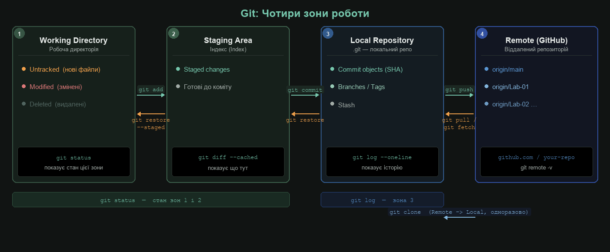
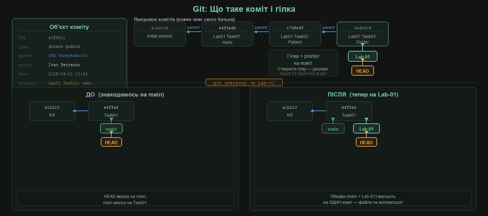
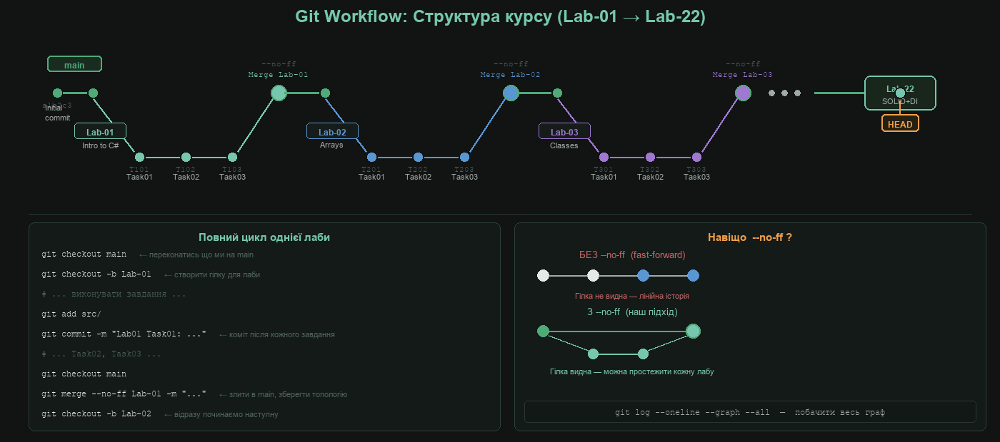
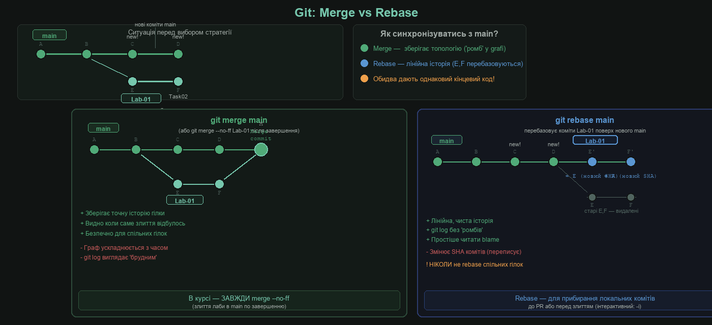

# Git & GitHub: Практичний воркшоп

> **Перед Lab-01.** Цей воркшоп — єдине що потрібно знати про Git для виконання всіх 22 лабораторних.  
> Ніяких попередніх знань не потрібно.

## Мета

Після цього воркшопу ти вмієш:

- Клонувати репозиторій і орієнтуватись у його структурі
- Створювати гілку для кожної лаби та правильно її називати
- Робити коміти з правильним форматом повідомлення
- Зливати лабу в `main` і переходити до наступної
- Пушити роботу на GitHub

---

## Частина 1. Архітектура Git

Git розбиває твою роботу на **чотири зони**. Зрозуміти їх — значить зрозуміти Git.



| Зона | Що тут живе | Ключова команда |
|------|-------------|-----------------|
| Working Directory | Файли які ти редагуєш | `git status` |
| Staging Area | Зміни підготовлені до коміту | `git add` |
| Local Repository | Зафіксована історія (`.git/`) | `git commit` |
| Remote (GitHub) | Твоя копія на сервері | `git push / pull` |

Важливо: `git add` не зберігає зміни назавжди — він лише переміщує їх до Staging. Тільки `git commit` фіксує знімок назавжди в локальному репо.

### Навіщо потрібна Staging Area?

Уявімо: ти сидів над Task02 і за день змінив 7 файлів. Більшість стосується Task02, але паралельно підправив якийсь баг у Task01 в іншому файлі. Без Staging Area лишається два варіанти: або всі 7 файлів в один коміт (каша в історії — незрозуміло що де), або взагалі нічого не комітити.

Staging Area вирішує це: ти вибираєш **саме ті файли** які стосуються поточного завдання, комітиш їх — і лише потім беришся за наступне.

```bash
# Day1: змінив і Doctor.cs, і DoctorService.cs, і щось підправив у Patient.cs
# Хочемо три окремих логічних коміти:

git add src/Models/Doctor.cs
git commit -m "Lab03 Task02: add Doctor class"

git add src/Services/DoctorService.cs
git commit -m "Lab03 Task02: implement DoctorService"

git add src/Models/Patient.cs
git commit -m "Lab03 Task01: fix null check in Patient"
```

Три логічних одиниці — три коміти — чиста зрозуміла історія. Так виглядає `git log`:

```
a1b2c3d Lab03 Task01: fix null check in Patient
3d4e5f6 Lab03 Task02: implement DoctorService
7g8h9i0 Lab03 Task02: add Doctor class
```

### Крок 1. Встановлення Git

Завантаж з [git-scm.com](https://git-scm.com/downloads) та встанови (всі налаштування за замовчуванням).

Перевірка:

```bash
git --version
# git version 2.x.x
```

### Крок 2. Налаштування імені та email

Git підписує кожен коміт твоїм іменем. Виконай один раз:

```bash
git config --global user.name "Іван Петренко"
git config --global user.email "ivan.petrenko@gmail.com"
```

Перевірка:

```bash
git config --list
# user.name=Іван Петренко
# user.email=ivan.petrenko@gmail.com
```

### Крок 3. Клонування репозиторію курсу

```bash
git clone https://github.com/<викладач>/OOP-Tomka-CourseForHardCoders.git
cd OOP-Tomka-CourseForHardCoders
```

`git clone` — це **одноразова** операція. Вона завантажує весь репозиторій разом з повною історією комітів. Після цього у тебе є локальна копія з якою можна працювати без інтернету.

```bash
git status
# On branch main
# nothing to commit, working tree clean
```

### Крок 3а. `.gitignore` — що не потрібно комітити

Коли ти відкриєш проєкт у Visual Studio і зіберш його — з'явиться купа тимчасових файлів:

```
src/bin/Debug/net8.0/MyApp.exe
src/bin/Debug/net8.0/MyApp.dll
src/obj/Debug/net8.0/MyApp.pdb
.vs/MyApp/v17/.suo
...
```

Їх **не можна комітити**: вони великі (MB), генеруються автоматично, залежать від твоєї машини. Якщо їх закомітити — репо розпухне, а колеги отримають чужі бінарники.

Для цього існує файл `.gitignore` — список патернів які Git повністю ігнорує.

Репо курсу вже містить `.gitignore`. Перевір:

```bash
cat .gitignore
# або відкрий у редакторі
```

Якщо `.gitignore` відсутній або неповний — створи/допиши в корені репо:

```gitignore
# C# / .NET
bin/
obj/
*.user
*.suo
.vs/
*.userprefs
.idea/
*.DotSettings.user

# Операційна система
.DS_Store
Thumbs.db
desktop.ini

# Конфіденційні дані
*.env
appsettings.Development.json
secrets.json
```

Перевір що `.gitignore` працює — після цих рядків `git status` не повинен показувати `bin/` або `obj/`:

```bash
# Збери проєкт, потім:
git status
# Ти маєш бачити лише свої .cs файли, а не сотні bin/obj файлів
```

> Якщо `bin/` все одно з'являється — файл `.gitignore` або не в тому місці, або вже заком'ічено відповідні папки. В такому разі: `git rm -r --cached bin/ obj/` і потім `git add .gitignore`.

---

## Частина 2. Що таке коміт і гілка

Перш ніж створювати гілки — треба розуміти що вони собою являють.



### Коміт — не різниця файлів, а знімок

Кожен коміт — це об'єкт із чотирма полями:

- **SHA** — унікальний 40-символьний хеш (ідентифікатор)
- **tree** — посилання на знімок усіх файлів проєкту в цей момент
- **parent** — SHA попереднього коміту (так формується ланцюжок)
- **message** — твоє повідомлення

Коміт **незмінний**. Якщо змінити повідомлення — Git створить новий коміт з новим SHA. Старий залишиться в базі.

### Гілка — просто pointer

Гілка — це файл із 41 байтом: SHA коміту на який вона вказує. Створити гілку дешево і безпечно — файли не копіюються.

```
main     → a3f82c1  (вказує на "Initial commit")
Lab-01   → 3a4b5c6  (вказує на "Lab01 Task03: Doctor")
HEAD     → Lab-01   (вказує на поточну гілку)
```

`HEAD` — це завжди поточне місце де ти знаходишся. Коли робиш `git checkout Lab-01`, HEAD переміщується на гілку Lab-01.

### Крок 4. Перша гілка

```bash
# Переконайся що ти на main
git checkout main

# Створи гілку для Lab-01 і одразу перейди на неї
git checkout -b Lab-01
```

Прапор `-b` означає "create + checkout". Після цього:

```bash
git branch
# * Lab-01
#   main
```

Зірочка показує поточну гілку.

### Крок 5. Читати вивід `git status`

`git status` — команда яку ти будеш запускати десятки разів. Важливо розуміти що вона показує.

**Стан після `git checkout -b Lab-01` (ще нічого не змінено):**

```
On branch Lab-01
nothing to commit, working tree clean
```

**Після того як створив новий файл `src/Program.cs`:**

```
On branch Lab-01
Untracked files:
  (use "git add <file>..." to include in what will be committed)
        src/Program.cs

nothing added to commit but untracked files present
```

`Untracked` = Git бачить файл але ще не відстежує його. `git add` починає відстеження.

**Після того як змінив вже існуючий файл:**

```
On branch Lab-01
Changes not staged for commit:
  (use "git add <file>..." to update what will be committed)
        modified:   src/Models/Patient.cs

Untracked files:
        src/Program.cs
```

Два сигнали:
- `modified` — файл вже був у репо, і ти його змінив
- `Untracked` — новий файл якого ще не було

**Після `git add src/`:**

```
On branch Lab-01
Changes to be committed:
  (use "git restore --staged <file>..." to unstage)
        new file:   src/Program.cs
        modified:   src/Models/Patient.cs
```

`Changes to be committed` = файли в Staging Area, готові до коміту. Якщо помітив помилку — `git restore --staged <file>` повертає файл зі Staging назад.

**Після `git commit`:**

```
On branch Lab-01
nothing to commit, working tree clean
```

Чисто — можна братись за наступне завдання.

Усі зміни які ти робиш — потрапляють в гілку `Lab-01`, а не в `main`.

---

## Частина 3. Workflow курсу

Кожна лаба — один цикл. Подивись на структуру всього курсу:



Як видно з графа: `main` — стабільна лінія. Кожна лаба — окрема гілка яка відходить від `main`, набирає коміти (по одному на завдання) і зливається назад. Після злиття одразу стартує наступна лаба.

### Формат коміту

Усі коміти в курсі дотримуються одного шаблону:

```
Lab01 Task01: коротко що зроблено
```

- `Lab01` — номер лаби (без дефіса, дві цифри)
- `Task01` — номер завдання (дві цифри)
- `: ` — двокрапка і пробіл
- Далі — дієслово + що: `add Patient class`, `implement GetCost`, `fix null check`

**Приклади:**

```
Lab01 Task01: add Hello World console output
Lab03 Task02: add Patient class with properties
Lab17 Task03: configure Fluent API for Doctor with WorkSchedule
```

### Крок 6. Коміт після кожного завдання

Повний цикл виглядає так. Після виконання завдання:

**6.1 — Переглянь що змінилось**

```bash
git status
# Changes not staged for commit:
#         modified:   src/Program.cs
# Untracked files:
#         src/Models/Patient.cs
```

Якщо хочеш побачити конкретні зміни (рядки):

```bash
git diff
# --- a/src/Program.cs
# +++ b/src/Program.cs
# @@ -1,3 +1,6 @@
# +Console.WriteLine("Hello, World!");
```

Рядки з `+` — додані, з `-` — видалені. `git diff` показує тільки нестейджені зміни. Для перегляду того що вже в Staging: `git diff --cached`.

**6.2 — Добав до Staging**

```bash
git add src/
# або конкретний файл:
git add src/Program.cs
```

Перевір що потрапило в Staging:

```bash
git status
# Changes to be committed:
#         modified:   src/Program.cs
#         new file:   src/Models/Patient.cs
```

**6.3 — Зафіксуй**

```bash
git commit -m "Lab01 Task01: add Hello World console output"
# [Lab-01 3a4b5c6] Lab01 Task01: add Hello World console output
#  2 files changed, 8 insertions(+)
```

Git підтвердить: SHA коміту (`3a4b5c6`), назву гілки, скільки файлів і рядків змінилось.

**6.4 — Переглянь результат**

```bash
git log --oneline
# 3a4b5c6 Lab01 Task01: add Hello World console output
# a1b2c3d Initial commit
```

Після кожного наступного завдання — повторюй цей цикл:

```
виконав завдання → git status → git diff → git add → git commit → далі
```

Один `git commit` на одне завдання. Не більше, не менше.

### Крок 7. Завершення лаби — злиття в main

Виконав усі завдання? Зливай в `main`:

```bash
# Перейди на main
git checkout main

# Злий гілку Lab-01 (--no-ff зберігає топологію гілки в графі)
git merge --no-ff Lab-01 -m "Merge Lab-01: Intro to C#"
```

Прапор `--no-ff` (no fast-forward) важливий: він створює явний merge-коміт навіть якщо злиття можна зробити лінійно. Завдяки цьому в `git log --graph` видно де починалась і де закінчилась кожна лаба.

Перевір результат:

```bash
git log --oneline --graph --all
# *   c8d9e0f Merge Lab-01: Intro to C#
# |\
# | * 3a4b5c6 Lab01 Task03: add Doctor class
# | * 2b3c4d5 Lab01 Task02: add Patient class
# | * 1a2b3c4 Lab01 Task01: add Hello World
# |/
# * a1b2c3d Initial commit
```

### Крок 8. Перехід до наступної лаби

Відразу після злиття:

```bash
git checkout -b Lab-02
```

Готово — Lab-02 стартує з чистого `main`.

---

## Частина 4. Merge vs Rebase

Під час роботи над лабою може виникнути ситуація: `main` пішов вперед (наприклад, викладач запушив нові файли) поки ти виконував завдання. Потрібно синхронізуватись.



### git merge main — зберігає топологію

```bash
git checkout Lab-01
git merge main
```

Створює **merge-коміт** який об'єднує дві лінії розробки. Граф набуває форми "ромба" — видно точний момент злиття. Це підхід який ми використовуємо для фінального злиття лаби в `main`.

### git rebase main — переписує поверх

```bash
git checkout Lab-01
git rebase main
```

Git "від'єднує" твої коміти `E` і `F`, застосовує нові коміти `C` і `D` з main, а потім "перекладає" твої коміти зверху. Результат: `E'` і `F'` з **новими SHA**. Стара `E` і `F` видаляються.

Плюс: лінійна, чиста історія.  
**Правило:** ніколи не робити `rebase` на гілці яку вже запушив і яку бачать інші. Rebase переписує SHA — у колег виникнуть конфлікти.

**Коли rebase доречний:** локальне прибирання комітів перед PR, `git rebase -i` для squash/reorder.

### Для курсу

У більшості випадків rebase не знадобиться — ти єдиний хто працює у своєму форку. Якщо викладач оновив репо — просто:

```bash
git checkout main
git pull origin main
git checkout Lab-01
git merge main   # або git rebase main — на свій розсуд
```

---

## Частина 5. Push на GitHub

### Крок 9. Запуши main після кожного злиття

```bash
git push origin main
```

### Крок 10. Запуши поточну лабу (для бекапу і перевірки)

```bash
git push origin Lab-01
```

Перша пуш гілки — можна скоротити через флаг `-u`:

```bash
git push -u origin Lab-01
# Тепер достатньо просто: git push
```

Переглянути що запушено:

```bash
git branch -r
# origin/main
# origin/Lab-01
# origin/Lab-02
```

---

## Частина 6. Аутентифікація GitHub

Перший `git push` часто дивує студентів — Git запитує логін або взагалі відхиляє з'єднання. Причина: GitHub вже кілька років **не приймає звичайний пароль** через командний рядок. Потрібна або Token-автентифікація, або SSH.

### Варіант A — HTTPS + Git Credential Manager (рекомендовано на Windows)

Git for Windows встановлює **Git Credential Manager (GCM)** автоматично. При першому `git push` відкриється вікно браузера з GitHub — просто авторизуйся там.

```bash
git push origin main
# Відкриється браузер → GitHub → "Authorize Git Credential Manager"
# Після підтвердження — пуш пройде
# Наступні pushи — без запиту (токен кешується)
```

Якщо браузер не відкрився і Git запитує пароль у терміналі — пароль **не підійде**. Потрібен Personal Access Token:

1. GitHub → верхній правий куток → **Settings**
2. Лівий сайдбар → **Developer settings** → **Personal access tokens** → **Tokens (classic)**
3. **Generate new token** → вибери scopes: `repo` (повний доступ до репо)
4. Скопіюй токен — він показується **тільки один раз**
5. Вставляй його як пароль коли Git запитує

```bash
git push origin main
# Username: your-github-username
# Password: ghp_xxxxxxxxxxxx   ← вставляєш токен, не пароль
```

### Варіант B — SSH ключ (зручніше на Linux / macOS)

SSH-ключ — це пара файлів: приватний (тільки у тебе) і публічний (на GitHub). Після налаштування — ніяких запитів пароля ніколи.

**Крок 1 — Згенерувати ключ:**

```bash
ssh-keygen -t ed25519 -C "your-email@gmail.com"
# Enter file in which to save the key: (натисни Enter — default location)
# Enter passphrase: (можна залишити порожнім для зручності)
```

Ключ збережеться в `~/.ssh/id_ed25519` (приватний) і `~/.ssh/id_ed25519.pub` (публічний).

**Крок 2 — Додати публічний ключ на GitHub:**

```bash
# Скопіюй вміст публічного ключа:
cat ~/.ssh/id_ed25519.pub
# ssh-ed25519 AAAA... your-email@gmail.com
```

GitHub → **Settings** → **SSH and GPG keys** → **New SSH key** → вставляєш вміст файлу.

**Крок 3 — Перевір з'єднання:**

```bash
ssh -T git@github.com
# Hi username! You've successfully authenticated, but GitHub does not provide shell access.
```

**Крок 4 — Клонуй репо через SSH URL (замість HTTPS):**

```bash
git clone git@github.com:<викладач>/OOP-Tomka-CourseForHardCoders.git
```

Якщо вже клонував через HTTPS — зміни remote:

```bash
git remote set-url origin git@github.com:<викладач>/OOP-Tomka-CourseForHardCoders.git
```

### Перевірка remote URL

```bash
git remote -v
# origin  https://github.com/...   (HTTPS варіант)
# origin  git@github.com:...       (SSH варіант)
```

---

## Частина 7. GitHub у браузері

Після `git push` — перейди в браузер на сторінку репозиторію.

**Перегляд гілок:**
`https://github.com/<user>/<repo>/branches` — список усіх гілок. Видно чи запушилась `Lab-01`.

**Перегляд комітів конкретної гілки:**
Натисни на назву гілки → вкладка **Commits** → бачиш усі коміти з повідомленнями, датами, SHA.

**Порівняти гілку з main:**
На сторінці гілки → кнопка **Compare** → видно які файли і рядки змінились порівняно з `main`.

**Переглянути конкретний коміт:**
Натисни на SHA або повідомлення будь-якого коміту → бачиш diff: які рядки додані (зелені), які видалені (червоні).

**Перевірити структуру файлів:**
Вкладка **Code** → можна навігувати по папках, відкривати файли, бачити їх стан на будь-якій гілці через dropdown зліва.

---

## Типові помилки

### 1. Коміт потрапив у `main` замість `Lab-01`

```bash
# Відмінити останній коміт з main (зміни залишаться в файлах)
git checkout main
git reset --soft HEAD~1

# Перейти на Lab-01 і закомітити там
git checkout Lab-01
git add .
git commit -m "Lab01 Task01: ..."
```

### 2. Забув `git add` — файл не потрапив у коміт

```bash
git status                    # видно що файл не staged
git add src/Models/Patient.cs # додай конкретний файл
git commit --amend --no-edit  # додай до попереднього коміту (якщо ще не пушив)
```

### 3. Неправильний формат коміту

```bash
# Змінити повідомлення останнього коміту (якщо ще не пушив)
git commit --amend -m "Lab01 Task01: add Patient class with properties"
```

### 4. Конфлікт при злитті

```
Auto-merging src/Models/Patient.cs
CONFLICT (content): Merge conflict in src/Models/Patient.cs
```

Відкрий файл — Git позначив конфліктні місця:

```csharp
<<<<<<< HEAD
public string FullName { get; set; }
=======
public string FirstName { get; set; }
public string LastName  { get; set; }
>>>>>>> Lab-01
```

Обери правильний варіант (або об'єднай), видали маркери, потім:

```bash
git add src/Models/Patient.cs
git commit -m "resolve merge conflict in Patient"
```

### 5. Push rejected — remote has changes

```
! [rejected] main -> main (non-fast-forward)
```

Хтось (або ти з іншого комп'ютера) запушив в `main`. Спочатку отримай:

```bash
git pull origin main --rebase
git push origin main
```

---

## Шпаргалка

| Команда | Що робить |
|---------|-----------|
| `git clone <url>` | Скачати репо (одноразово) |
| `git status` | Стан робочої директорії і staging |
| `git diff` | Що змінилось (не staged) |
| `git diff --cached` | Що в staging |
| `git add <path>` | Додати файл/директорію до staging |
| `git add -p` | Додавати по частинах (інтерактивно) |
| `git commit -m "..."` | Зафіксувати зміни |
| `git log --oneline` | Коротка історія комітів |
| `git log --oneline --graph --all` | Граф усіх гілок |
| `git checkout main` | Перейти на гілку main |
| `git checkout -b Lab-01` | Створити гілку і перейти на неї |
| `git branch` | Список гілок (зірочка = поточна) |
| `git merge --no-ff Lab-01 -m "..."` | Злити Lab-01 в поточну гілку |
| `git push origin main` | Запушити main на GitHub |
| `git push -u origin Lab-01` | Запушити гілку і встановити tracking |
| `git pull origin main` | Отримати зміни з GitHub |
| `git stash` | Тимчасово сховати незакомічені зміни |
| `git stash pop` | Відновити сховані зміни |
| `git restore <file>` | Відмінити зміни у файлі (Working Dir) |
| `git restore --staged <file>` | Прибрати файл зі staging |
| `git reset --soft HEAD~1` | Відмінити останній коміт (зміни лишаються) |
| `git diff` | Зміни в Working Directory (ще не staged) |
| `git diff --cached` | Зміни в Staging Area (вже додані, ще не закомічені) |
| `git show <SHA>` | Деталі конкретного коміту (diff + metadata) |
| `git commit --amend -m "..."` | Змінити повідомлення останнього коміту (до push!) |
| `git rm -r --cached <dir>` | Прибрати директорію з відстеження (після .gitignore) |
| `git remote -v` | Показати URL remote-репозиторіїв |
| `git remote set-url origin <url>` | Змінити URL remote (HTTPS ↔ SSH) |

---

## Структура гілок у курсі

```
main
├── Lab-01   (Intro to C#)      → merge → main
├── Lab-02   (Arrays)           → merge → main
├── Lab-03   (Classes)          → merge → main
│   ...
├── Lab-17   (EF Core Basics)   → merge → main
├── Lab-18   (EF Relations)     → merge → main
│   ...
└── Lab-22   (SOLID + DI)       → merge → main
```

Кожна гілка: `Lab-XX` з великої літери, дві цифри, дефіс.  
Кожен коміт: `LabXX TaskXX: дієслово + що зроблено`.
