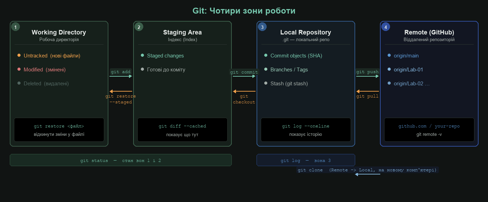
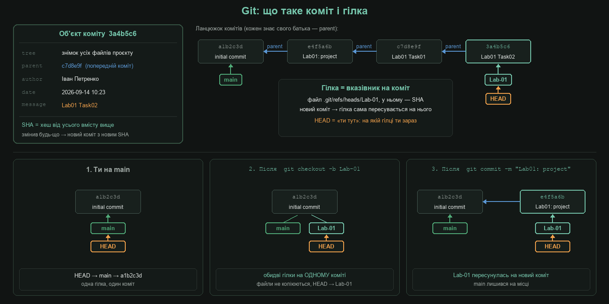
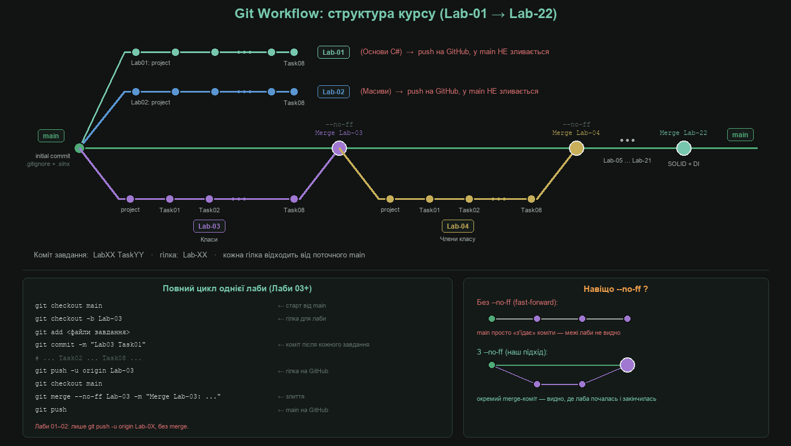
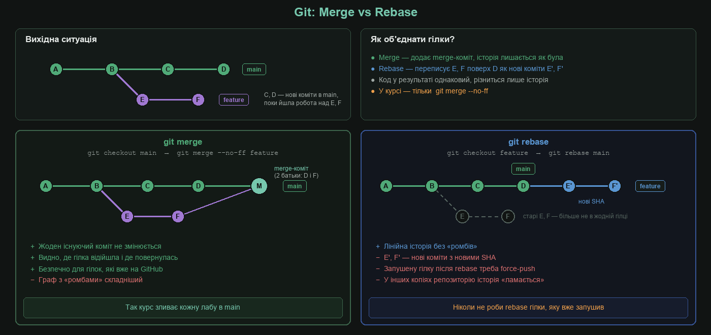

# Git & GitHub: Практичний воркшоп

> **Перед Lab-01.** Цей воркшоп — усе, що потрібно знати про Git для виконання всіх 22 лабораторних.
> Ніяких попередніх знань не потрібно.

## Мета

Після цього воркшопу ти вмієш:

- Створити власний репозиторій курсу і під'єднати його до GitHub
- Створювати гілку для кожної лаби та правильно її називати
- Робити коміти з правильним форматом повідомлення
- Зливати лабу в `main` і переходити до наступної
- Пушити роботу на GitHub і продовжувати її з іншого комп'ютера

> **Репозиторій курсу викладача** (`OOP-Tomka-CourseForHardCoders`) — це
> **довідник**: еталонний код, лекції, ці інструкції. Ти його не форкаєш і не
> працюєш у ньому — ти будуєш **свій** проєкт зі своїм доменом.

---

## Частина 0. Підготовка

### Крок 1. Встановлення інструментів

Потрібні три речі:

| Що | Звідки | Перевірка |
|----|--------|-----------|
| Git | [git-scm.com/downloads](https://git-scm.com/downloads) — усі налаштування інсталятора за замовчуванням | `git --version` |
| .NET SDK 10 | [dotnet.microsoft.com/download](https://dotnet.microsoft.com/download) | `dotnet --version` |
| Акаунт GitHub | [github.com/signup](https://github.com/signup) | — |

```bash
git --version
# git version 2.5x.x
dotnet --version
# 10.0.xxx
```

Усі команди воркшопу працюють і в **Git Bash**, і в **PowerShell**, і в терміналі
Visual Studio / Rider / VS Code.

### Крок 2. Налаштування Git (один раз на комп'ютер)

Git підписує кожен коміт твоїм іменем і email. Використай той самий email, що й
в акаунті GitHub — тоді GitHub пов'яже коміти з твоїм профілем:

```bash
git config --global user.name "Іван Петренко"
git config --global user.email "ivan.petrenko@gmail.com"
```

Ще два налаштування, які знімуть типові проблеми:

```bash
git config --global init.defaultBranch main   # нові репозиторії стартують з гілки main
git config --global pull.rebase false         # git pull зливає зміни, а не переписує історію
```

Перевірка:

```bash
git config --global --list
# user.name=Іван Петренко
# user.email=ivan.petrenko@gmail.com
# init.defaultbranch=main
# pull.rebase=false
```

---

## Частина 1. Архітектура Git

Git розбиває твою роботу на **чотири зони**. Зрозуміти їх — значить зрозуміти Git.



| Зона | Що тут живе | Як сюди потрапити |
|------|-------------|-------------------|
| Working Directory | Файли, які ти редагуєш | редагуєш у IDE |
| Staging Area (index) | Зміни, підготовлені до наступного коміту | `git add` |
| Local Repository (`.git/`) | Зафіксована історія комітів | `git commit` |
| Remote (GitHub) | Копія репозиторію на сервері | `git push` |

У зворотний бік:

- `git restore <файл>` — відкинути незбережені зміни у файлі (повернути як в останньому коміті).
- `git restore --staged <файл>` — прибрати файл зі Staging (самі зміни у файлі лишаються).
- `git pull` — забрати нові коміти з GitHub і одразу оновити ними робочі файли.

Важливо: `git add` нічого не зберігає в історії — він лише кладе зміни в Staging.
Тільки `git commit` фіксує знімок у локальному репозиторії, і тільки `git push`
відправляє його на GitHub.

### Навіщо потрібна Staging Area?

Уяви: ти завершив Task01 у Лабі 03 (новий клас `Patient`), забув закомітити і вже
почав Task02 (клас `Doctor`). Тепер змінено кілька файлів, і вони стосуються різних
завдань. Без Staging Area лишається або один коміт «про все», або жодного.

Staging Area дозволяє вибрати **саме ті файли**, які стосуються одного завдання:

```bash
git add ClinicApp/Patient.cs
git commit -m "Lab03 Task01"

# ... дописав Task02 ...
git add ClinicApp/Doctor.cs ClinicApp/Program.cs
git commit -m "Lab03 Task02"
```

Кожне завдання — свій коміт, історія читається з першого погляду:

```
git log --oneline
# 5c1e9a2 Lab03 Task02
# 8f3d0b7 Lab03 Task01
```

> Якщо один файл (наприклад, `Program.cs`) містить зміни для обох завдань,
> `git add -p <файл>` дозволяє додати до Staging лише частину змін — Git
> по черзі покаже кожен шматок і спитає `y` (додати) чи `n` (пропустити).

---

## Частина 2. Старт репозиторію курсу

> Це **той самий** Крок 0 з Лаби 01. Зробив його тут — у Лабі 01 одразу переходь до Кроку 1.

### Крок 3. Локальний репозиторій

Свій проєкт курсу починається з порожньої теки:

```bash
mkdir oop-course
cd oop-course
git init
git branch -m main
```

`git init` створює приховану теку `.git/` — це і є локальний репозиторій.
`git branch -m main` гарантує, що основна гілка називається `main` (на випадок,
якщо Крок 2 пропущено і Git назвав її `master`).

### Крок 4. `.gitignore` — що не потрібно комітити

Коли ти збереш проєкт, з'явиться купа згенерованих файлів:

```
Lab01/bin/Debug/net10.0/Lab01.dll
Lab01/bin/Debug/net10.0/Lab01.exe
Lab01/obj/project.assets.json
.vs/oop-course/...
```

Їх **не можна комітити**: вони великі, генеруються автоматично при кожній збірці
і залежать від твоєї машини. У Git має бути лише вихідний код.

Для цього існує файл `.gitignore` — список шаблонів, які Git повністю ігнорує.
Створи його в корені `oop-course/` з таким вмістом:

```gitignore
# C# / .NET
bin/
obj/
*.user
*.suo
.vs/
.idea/

# ОС
.DS_Store
Thumbs.db

# Секрети
*.env
appsettings.Development.json
```

Шаблон `bin/` без шляху спрацьовує на **будь-якому** рівні вкладеності —
і для `Lab01/bin/`, і для `ClinicApp/bin/`.

> Створюючи файл у Блокноті, переконайся, що він називається саме `.gitignore`,
> а не `.gitignore.txt` (у «Зберегти як» обери тип «Усі файли»).

### Крок 5. Рішення (solution)

Рішення — файл, який тримає разом усі проєкти курсу, щоб Visual Studio / Rider
відкривали їх однією дією:

```bash
dotnet new sln --name oop-course
```

З .NET 10 ця команда створює `oop-course.slnx` (новий XML-формат рішення).
Старіші SDK створюють `oop-course.sln` — тоді в усіх командах курсу пиши `.sln`
замість `.slnx`.

### Крок 6. Перший коміт

```bash
git add .gitignore oop-course.slnx
git commit -m "chore: initial commit — gitignore + solution"
```

### Крок 7. Репозиторій на GitHub

1. На GitHub: **+** (угорі праворуч) → **New repository**.
2. Назва — `oop-course`. **Не** став галочки README, .gitignore, license —
   репозиторій має бути порожнім, інакше перший push буде відхилено.
3. **Create repository**.

Під'єднай локальний репозиторій і відправ `main`:

```bash
git remote add origin https://github.com/<ваш-логін>/oop-course.git
git push -u origin main
```

`origin` — коротке ім'я для адреси на GitHub. `-u` запам'ятовує зв'язок локальної
гілки з віддаленою — далі для `main` достатньо просто `git push` і `git pull`.

На Windows під час першого push відкриється вікно входу в GitHub — це нормально.
Якщо замість цього Git питає пароль у терміналі — див. **Частину 6**.

---

## Частина 3. Що таке коміт і гілка

Перш ніж створювати гілки — треба розуміти, що вони собою являють.



### Коміт — не різниця файлів, а знімок

Кожен коміт зберігає:

- **tree** — знімок усіх файлів проєкту на цей момент
- **parent** — посилання на попередній коміт (так утворюється ланцюжок)
- **author** — хто і коли зробив коміт
- **message** — повідомлення

**SHA** — це 40-символьний хеш, обчислений з усього вмісту коміту. Він і є
ідентифікатором коміту; у виводі зазвичай показують перші 7 символів (`3a4b5c6`).

Коміт **незмінний**. Будь-яка «зміна» (наприклад, `git commit --amend`) насправді
створює **новий** коміт з новим SHA. А оскільки SHA залежить від `parent`,
змінити старий коміт означає змінити SHA і всіх комітів після нього.

### Гілка — просто вказівник

Гілка — це крихітний файл у `.git/refs/heads/`, де записано SHA одного коміту.
Створити гілку дешево і безпечно — файли не копіюються. Коли ти робиш новий
коміт, поточна гілка автоматично пересувається на нього.

```
main     → a1b2c3d   ("chore: initial commit — gitignore + solution")
Lab-01   → 3a4b5c6   ("Lab01 Task03")
HEAD     → Lab-01    (на якій гілці ти зараз)
```

`HEAD` — це «ти тут». `git checkout Lab-01` переставляє HEAD на гілку `Lab-01` і
підміняє файли в робочій теці на її версію.

### Крок 8. Перша гілка

```bash
git checkout main          # переконайся, що ти на main
git checkout -b Lab-01     # створи гілку Lab-01 і одразу перейди на неї
```

Прапор `-b` означає «створити + перейти». Після цього:

```bash
git branch
# * Lab-01
#   main
```

Зірочка показує поточну гілку. Усі наступні коміти потрапляють у `Lab-01`, а не в `main`.

### Крок 9. Читати вивід `git status`

`git status` — команда, яку ти запускатимеш десятки разів. Ось що вона показує
на різних етапах (приклад — Задача 2 Лаби 01).

**Нічого не змінено:**

```
On branch Lab-01
nothing to commit, working tree clean
```

**Створив новий файл `Lab01/Task2.cs`:**

```
On branch Lab-01
Untracked files:
  (use "git add <file>..." to include in what will be committed)
        Lab01/Task2.cs

nothing added to commit but untracked files present (use "git add" to track)
```

`Untracked` — Git бачить файл, але ще не відстежує його.

**Ще й змінив існуючий `Lab01/Program.cs`** (додав виклик `Task2.Run()`):

```
On branch Lab-01
Changes not staged for commit:
  (use "git add <file>..." to update what will be committed)
  (use "git restore <file>..." to discard changes in working directory)
        modified:   Lab01/Program.cs

Untracked files:
  (use "git add <file>..." to include in what will be committed)
        Lab01/Task2.cs

no changes added to commit (use "git add" and/or "git commit -a")
```

- `modified` — файл уже був у репозиторії, і ти його змінив
- `Untracked` — новий файл, якого ще не було

**Після `git add Lab01/Task2.cs Lab01/Program.cs`:**

```
On branch Lab-01
Changes to be committed:
  (use "git restore --staged <file>..." to unstage)
        modified:   Lab01/Program.cs
        new file:   Lab01/Task2.cs
```

`Changes to be committed` — файли в Staging, готові до коміту. Додав зайве —
`git restore --staged <файл>` поверне його назад.

**Після `git commit -m "Lab01 Task02"`:**

```
On branch Lab-01
nothing to commit, working tree clean
```

Чисто — можна братися за наступне завдання.

---

## Частина 4. Workflow курсу

Кожна лаба — один цикл: гілка від `main` → коміт на кожне завдання → push → злиття в `main`.



`main` — стабільна лінія. З Лаби 03 кожна лаба відходить від `main`, набирає
коміти і зливається назад — так основний проєкт росте лаба за лабою.

> **Виняток — Лаби 01 і 02.** Це окремі проєкти-тренажери (`Lab01/`, `Lab02/`).
> Їхні гілки ти **пушиш на GitHub, але в `main` НЕ зливаєш**. Обидві відходять
> від першого коміту `main`. Реальне дерево `main` починає рости з Лаби 03
> (основний проєкт, напр. `ClinicApp/`).

### Іменування

| Що | Формат | Приклади |
|----|--------|----------|
| Гілка | `Lab-XX` — велика літера, дефіс, дві цифри | `Lab-01`, `Lab-17` |
| Коміт завдання | `LabXX TaskYY` — без дефіса, дві цифри, **без опису** | `Lab01 Task01`, `Lab17 Task03` |
| Коміт створення проєкту | `LabXX: project` | `Lab01: project`, `Lab03: project` |
| Злиття в `main` | `Merge Lab-XX: <Назва>` | `Merge Lab-03: Defining Classes` |

Опис у коміті завдання не потрібен: номер лаби й завдання однозначно кажуть, що
це за зміни, а деталі видно в `git show`.

### Крок 10. Коміт після кожного завдання

**10.1 — Переглянь, що змінилось**

```bash
git status
```

Щоб побачити конкретні рядки:

```bash
git diff
# diff --git a/ClinicApp/Program.cs b/ClinicApp/Program.cs
# --- a/ClinicApp/Program.cs
# +++ b/ClinicApp/Program.cs
# @@ -1,3 +1,4 @@
# +var patient = new Patient("Іван", "Петренко");
```

Рядки з `+` — додані, з `-` — видалені. `git diff` показує лише зміни, **ще не
додані** в Staging; уже додані — `git diff --cached`. Нові (untracked) файли
`git diff` не показує зовсім.

**10.2 — Додай до Staging саме файли цього завдання**

```bash
git add ClinicApp/Patient.cs ClinicApp/Program.cs
git status
# Changes to be committed:
#         new file:   ClinicApp/Patient.cs
#         modified:   ClinicApp/Program.cs
```

**10.3 — Зафіксуй**

```bash
git commit -m "Lab03 Task01"
# [Lab-03 8f3d0b7] Lab03 Task01
#  2 files changed, 41 insertions(+)
#  create mode 100644 ClinicApp/Patient.cs
```

Git підтвердить гілку (`Lab-03`), SHA нового коміту (`8f3d0b7`) і скільки змінено.

**10.4 — Переглянь результат**

```bash
git log --oneline
# 8f3d0b7 (HEAD -> Lab-03) Lab03 Task01
# 0f1e2d3 Lab03: project
# a1b2c3d (origin/main, main) chore: initial commit — gitignore + solution
```

Після кожного завдання — той самий цикл:

```
виконав завдання → git status → git diff → git add → git commit → (git push)
```

Один коміт на одне завдання. `git push` після кожного коміту необов'язковий, але
корисний — це безкоштовна резервна копія.

### Крок 11. Завершення лаби

**Лаби 01 і 02** — тільки push гілки, без злиття:

```bash
git push -u origin Lab-01
```

**Лаби 03 і далі** — push гілки, злиття в `main`, push `main`:

```bash
git push -u origin Lab-03
git checkout main
git merge --no-ff Lab-03 -m "Merge Lab-03: Defining Classes"
git push
```

> **Завжди пиши `-m "..."` у `git merge`.** Без нього Git відкриє текстовий
> редактор (часто це Vim) для повідомлення злиття. Якщо таке сталося — див.
> «Типові помилки», п. 6.

Прапор `--no-ff` (no fast-forward) змушує Git створити **окремий merge-коміт**
навіть тоді, коли можна було б просто пересунути `main` вперед. Завдяки цьому в
графі видно, де почалась і де закінчилась кожна лаба:

```bash
git log --oneline --graph main
# *   c8d9e0f (HEAD -> main) Merge Lab-03: Defining Classes
# |\
# | * 3a4b5c6 (origin/Lab-03, Lab-03) Lab03 Task08
# | * ...     (Task07 … Task02)
# | * 8f3d0b7 Lab03 Task01
# | * 0f1e2d3 Lab03: project
# |/
# * a1b2c3d (origin/main) chore: initial commit — gitignore + solution
```

(`origin/main` тут ще стоїть на старому коміті — після `git push` він пересунеться на merge-коміт.)

### Крок 12. Перехід до наступної лаби

```bash
git checkout main
git checkout -b Lab-04
```

Нова гілка стартує з поточного `main` — тобто вже містить усю зроблену роботу.

### Перевірити, що все на GitHub

```bash
git status
# On branch main
# Your branch is up to date with 'origin/main'.

git branch -r
# origin/Lab-01
# origin/Lab-02
# origin/Lab-03
# origin/main
```

`up to date with 'origin/main'` означає, що на GitHub те саме, що й у тебе.
Якщо написано `ahead of 'origin/main' by N commits` — ти забув `git push`.

---

## Частина 5. Робота з кількох комп'ютерів

Репозиторій на GitHub — твоя «флешка». Удома, в аудиторії, на ноутбуці — працюєш
з тим самим репозиторієм.

### Крок 13. Перший раз на новому комп'ютері

Налаштуй Git (Частина 0, Крок 2) і **склонуй** свій репозиторій:

```bash
git clone https://github.com/<ваш-логін>/oop-course.git
cd oop-course
```

`git clone` скачує весь репозиторій з усією історією і всіма гілками. Локально
створюється лише `main`; щоб продовжити лабу, просто перейди на її гілку:

```bash
git checkout Lab-03
# branch 'Lab-03' set up to track 'origin/Lab-03'.
```

Git сам створить локальну `Lab-03` з `origin/Lab-03`.

### Правило двох комп'ютерів

```
сів за комп'ютер      → git pull     (забрати те, що запушив з іншого місця)
закінчив роботу        → git push     (віддати зроблене на GitHub)
```

Обидві команди працюють з **поточною** гілкою. Якщо працюєш і з `main`, і з
гілкою лаби — зроби `git pull` на кожній.

Забув `git pull` і вже щось закомітив? Тоді `git push` буде відхилено —
див. «Типові помилки», п. 5.

---

## Частина 6. Аутентифікація GitHub

GitHub **не приймає пароль акаунта** для `git push` з командного рядка (з 2021 року).
Потрібен вхід через браузер, токен або SSH-ключ.

### Варіант A — HTTPS + Git Credential Manager (рекомендовано на Windows)

Git for Windows встановлює **Git Credential Manager (GCM)** автоматично. При першому
`git push` з'явиться вікно входу в GitHub — обери **Sign in with your browser** і
підтверди доступ у браузері. Після цього Git запам'ятає вхід, і наступні push
пройдуть без запитів.

Якщо вікна немає, а Git питає `Password` у терміналі — пароль акаунта **не підійде**.
Потрібен Personal Access Token:

1. GitHub → аватар (угорі праворуч) → **Settings**
2. Внизу лівого меню → **Developer settings** → **Personal access tokens** → **Tokens (classic)**
3. **Generate new token (classic)** → вкажи термін дії → постав галочку `repo`
4. **Generate token** і скопіюй його — він показується **лише один раз**
5. Під час push вставляй токен замість пароля

```
git push
# Username for 'https://github.com': your-github-username
# Password for 'https://...':          ← вставляєш токен (символи не відображаються)
```

### Варіант B — SSH-ключ

SSH-ключ — пара файлів: приватний (лише в тебе) і публічний (на GitHub).

**1. Згенеруй ключ:**

```bash
ssh-keygen -t ed25519 -C "ivan.petrenko@gmail.com"
# Enter file in which to save the key: (Enter — розташування за замовчуванням)
# Enter passphrase: (можна залишити порожнім)
```

Ключ з'явиться у `~/.ssh/id_ed25519` (приватний) і `~/.ssh/id_ed25519.pub` (публічний).

**2. Додай публічний ключ на GitHub:**

```bash
cat ~/.ssh/id_ed25519.pub
# ssh-ed25519 AAAA... ivan.petrenko@gmail.com
```

Скопіюй увесь рядок → GitHub → **Settings** → **SSH and GPG keys** → **New SSH key** → встав → **Add SSH key**.

**3. Перевір з'єднання:**

```bash
ssh -T git@github.com
# Hi your-github-username! You've successfully authenticated, but GitHub does not provide shell access.
```

На перше питання `Are you sure you want to continue connecting (yes/no)?` відповідай `yes`.

**4. Переключи `origin` на SSH-адресу:**

```bash
git remote set-url origin git@github.com:<ваш-логін>/oop-course.git
```

Для нового комп'ютера клонуй одразу по SSH: `git clone git@github.com:<ваш-логін>/oop-course.git`.

### Перевірка адреси remote

```bash
git remote -v
# origin  https://github.com/<ваш-логін>/oop-course.git (fetch)   ← HTTPS
# origin  git@github.com:<ваш-логін>/oop-course.git (fetch)       ← SSH
```

---

## Частина 7. Merge vs Rebase (довідково)

У курсі використовується **лише merge**. Цей розділ пояснює, чим відрізняється
rebase, — ти зустрінеш його в реальних командах.



Ситуація: від коміту `B` відійшла гілка з комітами `E`, `F`, а в `main` тим часом
з'явились `C`, `D`. Як об'єднати?

### Merge — зберігає історію як є

```bash
git checkout main
git merge --no-ff feature -m "Merge feature"
```

Створюється новий **merge-коміт** з двома батьками (`D` і `F`). Усі старі коміти
лишаються незмінними, у графі видно «ромб» — де гілка відійшла і де повернулась.
Саме так курс зливає кожну лабу в `main`.

### Rebase — переписує гілку поверх нового `main`

```bash
git checkout feature
git rebase main
```

Git бере зміни комітів `E` і `F` і створює **нові** коміти `E'` і `F'` поверх `D`.
Вміст той самий, але SHA нові (бо змінився `parent`). Старі `E` і `F` більше не
належать жодній гілці. Історія виходить лінійною, без ромбів.

| | Merge | Rebase |
|---|---|---|
| Історія | Справжня, з розгалуженнями | Лінійна, «переписана» |
| SHA існуючих комітів | Не змінюються | Змінюються |
| Безпечно для запушених гілок | Так | **Ні** — потрібен force-push, у інших людей зламається історія |

**Правило:** ніколи не роби rebase гілки, яку вже запушив.
У курсі всі гілки лаб пушаться, тому rebase тут не потрібен.

> Так само **не використовуй `git pull --rebase`** у цьому курсі: rebase
> розгладжує merge-коміти `--no-ff`, і з графа зникають межі лаб. Налаштування
> `pull.rebase false` з Кроку 2 захищає від цього.

---

## Частина 8. GitHub у браузері

Після `git push` відкрий сторінку репозиторію `https://github.com/<ваш-логін>/oop-course`.

| Що подивитись | Як |
|---------------|----|
| Усі гілки | Кнопка з назвою гілки (над списком файлів) → **View all branches**, або `…/oop-course/branches` |
| Файли певної гілки | Та сама кнопка → обери гілку; далі вкладка **Code** показує її стан |
| Історія комітів гілки | Посилання **N Commits** (з іконкою годинника) праворуч над списком файлів, або `…/oop-course/commits/Lab-03` |
| Зміни в одному коміті | Клік по повідомленню коміту — зелені рядки додані, червоні видалені |
| Різниця гілки з `main` | `…/oop-course/compare/main...Lab-03` |
| Граф усіх гілок | **Insights** → **Network** |

---

## Типові помилки

### 1. Закомітив у `main` замість гілки лаби

Поки не запушив — перенеси коміт:

```bash
git reset --soft HEAD~1      # скасувати коміт у main; зміни лишаються в Staging
git checkout Lab-03          # або git checkout -b Lab-03, якщо гілки ще немає
git commit -m "Lab03 Task01" # закомітити ті самі зміни вже в гілці лаби
```

Якщо `git checkout` відмовляється (`Your local changes ... would be overwritten`):

```bash
git stash                    # тимчасово сховати зміни
git checkout Lab-03
git stash pop                # повернути їх
git add <файли>
git commit -m "Lab03 Task01"
```

### 2. Забув додати файл у коміт

Поки **не запушив** — доклади файл в останній коміт:

```bash
git add ClinicApp/Patient.cs
git commit --amend --no-edit   # --no-edit: повідомлення лишається те саме
```

Якщо вже запушив — не переписуй історію, просто зроби ще один коміт з тим самим
повідомленням (`Lab03 Task01`).

### 3. Неправильне повідомлення коміту

Поки не запушив:

```bash
git commit --amend -m "Lab03 Task01"
```

### 4. Конфлікт при злитті

```
Auto-merging ClinicApp/Patient.cs
CONFLICT (content): Merge conflict in ClinicApp/Patient.cs
Automatic merge failed; fix conflicts and then commit the result.
```

Відкрий файл — Git позначив обидві версії:

```csharp
<<<<<<< HEAD
public string FullName { get; set; }
=======
public string FirstName { get; set; }
public string LastName  { get; set; }
>>>>>>> Lab-03
```

Верхня частина — версія поточної гілки (`HEAD`), нижня — гілки, яку зливаєш.
Залиш правильний варіант (або об'єднай), **видали всі три рядки-маркери**, збережи, потім:

```bash
git add ClinicApp/Patient.cs
git commit --no-edit           # завершити злиття з уже підготовленим повідомленням
```

Передумав зливати — `git merge --abort` поверне все як було.

### 5. Push rejected

```
! [rejected]        main -> main (fetch first)
error: failed to push some refs to 'https://github.com/...'
```

На GitHub є коміти, яких немає в тебе (запушив з іншого комп'ютера). Спочатку забери їх:

```bash
git pull
git push
```

Якщо `git pull` зупинився з конфліктом — розв'яжи його як у п. 4.

### 6. Застряг у Vim

Ти запустив `git merge` або `git commit` без `-m`, і термінал перетворився на
незрозумілий редактор. Це Vim. Щоб вийти:

- **зберегти і продовжити:** `Esc`, потім набери `:wq` і `Enter`
- **скасувати:** `Esc`, потім `:q!` і `Enter`

### 7. `pathspec 'oop-course.sln' did not match any files`

Твій SDK створив `oop-course.slnx` (або навпаки). Подивись реальну назву командою
`ls` (або `dir`) і використовуй її в `git add`.

### 8. `bin/` або `obj/` уже потрапили в репозиторій

Буває, якщо `.gitignore` створено пізніше, ніж перший `git add`. `.gitignore` не
діє на файли, які Git уже відстежує, — їх треба прибрати з індексу:

```bash
git rm -r --cached .           # прибрати все з індексу (файли на диску не чіпає)
git add .                      # додати знову — тепер з урахуванням .gitignore
git commit -m "chore: remove build output from git"
```

---

## Шпаргалка

| Команда | Що робить |
|---------|-----------|
| `git init` | Створити локальний репозиторій (один раз) |
| `git clone <url>` | Скачати репозиторій з GitHub (напр. свій — на новий комп'ютер) |
| `git status` | Стан робочої теки і Staging |
| `git diff` | Зміни, ще не додані в Staging |
| `git diff --cached` | Зміни в Staging (додані, ще не закомічені) |
| `git add <файли>` | Додати зміни до Staging |
| `git add -p <файл>` | Додати лише частину змін у файлі (інтерактивно) |
| `git commit -m "..."` | Зафіксувати Staging як коміт |
| `git log --oneline` | Коротка історія поточної гілки |
| `git log --oneline --graph --all` | Граф усіх гілок |
| `git show <SHA>` | Деталі конкретного коміту |
| `git branch` | Список локальних гілок (зірочка — поточна) |
| `git branch -r` | Гілки на GitHub |
| `git checkout <гілка>` | Перейти на гілку |
| `git checkout -b Lab-03` | Створити гілку і перейти на неї |
| `git merge --no-ff Lab-03 -m "Merge Lab-03: ..."` | Злити `Lab-03` у поточну гілку з merge-комітом |
| `git merge --abort` | Скасувати злиття з конфліктом |
| `git push -u origin Lab-03` | Перший push гілки (запам'ятати зв'язок) |
| `git push` | Push поточної гілки (після `-u`) |
| `git pull` | Забрати зміни поточної гілки з GitHub |
| `git stash` / `git stash pop` | Тимчасово сховати / повернути незакомічені зміни |
| `git restore <файл>` | Відкинути зміни у файлі |
| `git restore --staged <файл>` | Прибрати файл зі Staging |
| `git commit --amend` | Змінити останній коміт (лише до push!) |
| `git reset --soft HEAD~1` | Скасувати останній коміт, зміни лишаються в Staging |
| `git rm -r --cached <шлях>` | Перестати відстежувати файли (лишити на диску) |
| `git remote -v` | Адреси remote-репозиторіїв |
| `git remote set-url origin <url>` | Змінити адресу remote (HTTPS ↔ SSH) |

---

## Структура гілок у курсі

```
main ── chore: initial commit — gitignore + solution
├── Lab-01   (Основи C#)        → push, БЕЗ злиття (тренажер Lab01/)
├── Lab-02   (Масиви)           → push, БЕЗ злиття (тренажер Lab02/)
├── Lab-03   (Класи)            → merge → main   ← тут стартує основний проєкт
├── Lab-04   (Члени класу)      → merge → main
│   ...
├── Lab-17   (EF Core: основи)  → merge → main
│   ...
└── Lab-22   (SOLID + DI)       → merge → main
```

Кожна гілка: `Lab-XX` — велика літера, дефіс, дві цифри.
Кожен коміт завдання: `LabXX TaskYY` — дві цифри, без опису.
