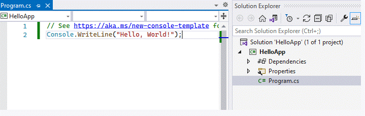
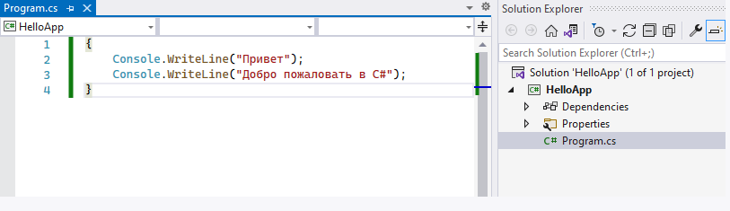
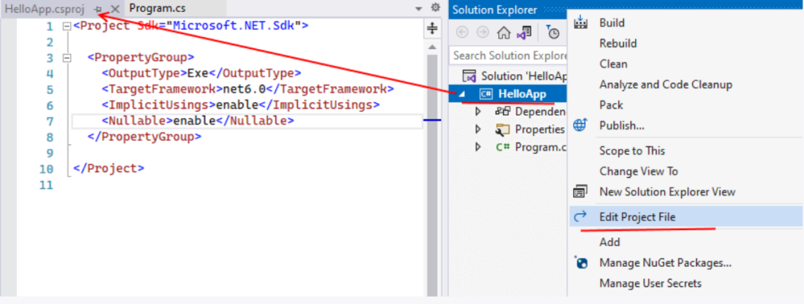

# Розділ 2. Основи програмування на С#

## 2.1. Структура програми

### Виконання програми

Весь код програми мовою C# міститься у файлах з розширенням `.cs`. За замовчуванням у проекті, який створюється у Visual Studio (а також при використанні .NET CLI), вже є один файл з кодом C# - файл `Program.cs` з наступним вмістом:

```csharp
// See https://aka.ms/new-console-template for more information
Console.WriteLine("Hello, World!");
```



Саме код файлу `Program.cs` виконується за умовчанням, якщо ми запустимо проект виконання. Але за потреби ми також можемо додавати інші файли з кодом C#.

### Інструкції

Базовим будівельним блоком програми є інструкції (statement). Інструкція представляє певну дію, наприклад, арифметичну операцію, виклик методу, оголошення змінної та присвоєння їй значення. Наприкінці кожної інструкції C# ставиться крапка з комою (`;`). Цей знак вказує компілятору на кінець інструкції. Наприклад, у проекті консольної програми, який створюється за замовчуванням, є такий рядок:

```csharp
Console.WriteLine("Hello, World!");
```

Цей рядок представляє виклик методу `Console.WriteLine`, який виводить на консоль рядок. У разі виклик методу є інструкцією і тому завершується точкою з комою.

Набір інструкцій може поєднуватися в блок коду. Блок коду полягає у фігурних дужках, а інструкції поміщаються між відкриваючою і закриваючою фігурними дужками. Наприклад, змінимо код файлу `Program.cs` на наступний:

```csharp
{
    Console.WriteLine("Привіт");
    Console.WriteLine("Ласкаво просимо в C#");
}
```

Тут блок коду містить дві інструкції. І при виконанні цього коду, консоль виведе два рядки.



У цьому блоці коду дві інструкції, які виводять на консоль певний рядок.


Одні блоки коду можуть містити інші блоки:

```csharp
{
    Console.WriteLine("Перший блок");
    {
        Console.WriteLine("Другий блок");
    }
}
```

### Реєстрозалежність

C# є регістрозалежною мовою. Це означає, що в залежності від регістру символів певні назви можуть представляти різні класи, методи, змінні і т.д. Наприклад, для виведення на консоль використовується метод `WriteLine` - його ім'я починається саме з великої літери: `WriteLine`. Якщо ми замість `Console.WriteLine` напишемо `Console.writeline`, то програма не скомпілюється, тому що даний метод обов'язково має називатися `WriteLine`, а не `writeline` або `WRITELINE` або якось інакше.

### Коментарі

Важливою частиною програмного коду є коментарі. Вони не є частиною програми, при компіляції вони ігноруються. Проте коментарі роблять код програми зрозумілішим, допомагаючи зрозуміти ті чи інші його частини.

Є два типи коментарів: однорядковий та багаторядковий. Однорядковий коментар розміщується на одному рядку після подвійного слішу `//`. А багаторядковий коментар полягає між символами `/* текст коментаря */`. Він може розміщуватись на декількох рядках. Наприклад:

```csharp
/*
перша програма на C#,
яка виводить вітання на консоль
*/
Console.WriteLine("Привіт"); // Виводимо рядок "Привіт"
Console.WriteLine("Ласкаво просимо до C#"); // Виводимо рядок "Ласкаво просимо до C#"
```

### Файл проекту

У кожному проекті C# є файл, який відповідає за загальну конфігурацію проекту. За промовчанням цей файл називається `Назва_проекту.csproj`. Отже, відкриємо цей файл. Для цього або подвійним кліком лівою кнопкою миші натиснемо на назву проекту, або натиснемо на назву проекту правою кнопкою миші і в меню виберемо пункт `Edit Project File`.



Після цього Visual Studio відкриє нам файл проекту, який виглядатиме так:

```xml
<Project Sdk="Microsoft.NET.Sdk">

  <PropertyGroup>
    <OutputType>Exe</OutputType>
    <TargetFramework>net6.0</TargetFramework>
    <ImplicitUsings>enable</ImplicitUsings>
    <Nullable>enable</Nullable>
  </PropertyGroup>

</Project>
```

Цей файл у вигляді коду XML визначає конфігурацію проекту і може містити безліч елементів. Зупинюся тільки на двох основних:

- `OutputType`: визначає вихідний тип проекту. Це може бути додаток у вигляді файлу з розширенням exe, яке запускається по натисканню. І також це може бути файл із розширенням `.dll` - деякий набір функціональностей, який використовується іншими проектами. За замовчуванням тут встановлено значення `Exe`, що означає, що ми створюємо програму, що виконується.
- `TargetFramework`: визначає версію фреймворку .NET, що застосовується для компіляції. У разі це значення `net6.0`, тобто застосовується .NET 6.0.

На ранніх етапах цей файл може не знадобитися, проте згодом може знадобитися внести деякі зміни в конфігурацію, і тоді може виникнути потреба у зверненні до цього файлу.

## 2.2. Змінні та константи

Для зберігання даних у програмі застосовуються змінні. Змінна являє собою іменовану область пам'яті, в якій зберігається значення певного типу. Змінна має тип, ім'я та значення. Тип визначає, що такого роду інформацію може зберігати змінна.

Перед використанням будь-яку змінну слід визначити. Синтаксис визначення змінної виглядає так:

```text
тип ім'я_змінної;
```

Спочатку йде тип змінної, потім її ім'я. Як ім'я змінної може виступати будь-яка довільна назва, яка задовольняє наступним вимогам:

- ім'я може містити будь-які цифри, букви та символ підкреслення, при цьому перший символ в імені має бути буквою або символом підкреслення
- в імені не повинно бути знаків пунктуації та пропусків
- ім'я не може бути ключовим словом мови C#. Таких слів не так багато, і під час роботи у Visual Studio середовище розробки підсвічує ключові слова синім кольором.

Хоча ім'я змінної може бути будь-яким, але слід давати змінним описові імена, які будуть говорити про їхнє призначення.

Наприклад, визначимо найпростішу змінну:

```csharp
string name;
```

В даному випадку визначено змінну `name`, яка має тип `string`, тобто змінна представляє рядок. Оскільки визначення змінної є інструкцією, то після нього ставиться крапка з комою.

При цьому слід враховувати, що C# є регістрозалежною мовою, тому наступні два визначення змінних будуть представляти дві різні змінні:

```csharp
string name;
string Name;
```

Після визначення змінної можна надати деяке значення:

```csharp
string name;
name = "Tom";
```

Оскільки змінна `name` представляє тип `string`, тобто рядок, ми можемо присвоїти їй рядок в подвійних лапках. Причому змінній можна присвоїти лише те значення, яке відповідає її типу.

Надалі за допомогою імені змінної ми зможемо звертатися до тієї області пам'яті, де зберігається її значення.

Також ми можемо відразу при визначенні присвоїти змінній значення. Цей прийом називається ініціалізацією:

```csharp
string name = "Tom";
```

Відмінною рисою змінних є те, що у програмі можна багаторазово змінювати їх значення. Наприклад, створимо невелику програму, в якій визначимо змінну, змінимо її значення та виведемо його на консоль:

```csharp
string name = "Tom"; // визначаємо змінну та ініціалізуємо її

Console.WriteLine(name); // Tom

name = "Bob"; // змінюємо значення змінної
Console.WriteLine(name); // Bob
```

Консольний висновок програми:


### Константи

Відмінною особливістю змінних є те, що ми можемо змінити їхнє значення в процесі роботи програми. Але, крім того, у C# є константи. Константа має бути обов'язково ініціалізована при визначенні, і після визначення значення константи не може бути змінено.

Константи призначені для опису таких значень, які не повинні змінюватись у програмі. Для визначення констант використовується ключове слово `const`, яке вказується перед типом константи:

```csharp
const string NAME = "Tom"; // Визначаємо константу
```

Так, у даному випадку визначено константу `NAME`, яка зберігає рядок `"Tom"`. Нерідко для назви констант використовується верхній регістр, але це не більше ніж умовність.

При використанні констант слід пам'ятати, що оголосити ми їх можемо лише один раз і що на момент компіляції вони повинні бути визначені. Так, у наступному випадку ми отримаємо помилку, тому що константі не надано початкове значення:

```csharp
const string NAME; //! Помилка - константа NAME не ініціалізована
```

Крім того, ми її не зможемо змінити у процесі роботи програми:

```csharp
const string NAME = "Tom"; // Визначаємо константу
NAME = "Bob"; // !Помилка - константі не можна змінити значення
```

Таким чином, якщо нам треба зберігати у програмі деякі дані, але їх не слід змінити, вони визначаються у вигляді констант. Якщо їх можна змінювати, всі вони визначаються у вигляді змінних.
