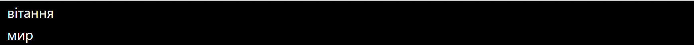

# 2.3. Літерали

Літерали представляють незмінні значення (іноді ще називають константами). Літерали можна передавати змінним як значення. Літерали бувають логічними, цілими, речовими, символьними і рядковими. І окремий літерал представляє ключове слово `null`.

## Логічні літерали

Є дві логічні константи - `true` (істина) і `false` (хибність):

```csharp
Console.WriteLine(true);
Console.WriteLine(false);
```

## Цілочисленні літерали

Цілочисленні літерали представляють позитивні та негативні цілі числа, наприклад, 1, 2, 3, 4, -7, -109. Цілочисленні літерали можуть бути виражені в десятковій, шістнадцятковій та двійковій формі.

З цілими числами в десятковій формі все має бути зрозумілим, тому що вони використовуються в повсякденному житті:

```csharp
Console.WriteLine(-11);
Console.WriteLine(5);
Console.WriteLine(505);
```

Числа у двійковій формі передуються символами `0b`, після яких йде набір з нулів та одиниць:

```csharp
Console.WriteLine(0b11);     // 3
Console.WriteLine(0b1011);   // 11
Console.WriteLine(0b100001); // 33
```

Для запису числа у шістнадцятковій формі застосовуються символи `0x`, після яких йде набір символів від 0 до 9 і від A до F, які власне представляють число:

```csharp
Console.WriteLine(0x0A); // 10
Console.WriteLine(0xFF); // 255
Console.WriteLine(0xA1); // 161
```

## Речові літерали

Речові літерали є дробовими числами. Цей тип літералів має дві форми. Перша форма - речові числа з фіксованою комою, при якій дробову частину відокремлюється від цілої частини крапкою. Наприклад:

```text
3.14
100.001
-0.38
```

Також речові літерали можуть визначатися в експоненційній формі `MEp`, де `M` - мантиса, `E` - експонента, яка фактично означає `* 10 ^` (помножити на десять ступеня), а `p` - порядок. Наприклад:

```csharp
Console.WriteLine(3.2e3);  // по суті дорівнює 3.2 * 10^3 = 3200
Console.WriteLine(1.2E-1); // дорівнює 1.2 * 10^-1 = 0.12
```

## Символьні літерали

Символьні літерали є одиночними символами. Символи полягають у одинарних лапках.

Символьні літерали бувають кількох видів. Насамперед це звичайні символи:

```csharp
'2'
'A'
'T'
```

Також ми можемо передати їх вивести на консоль за допомогою `Console.WriteLine`:

```csharp
Console.WriteLine('2');
Console.WriteLine('A');
Console.WriteLine('T');
```

Спеціальну групу представляють керуючі послідовності. Керуюча послідовність є символом, перед яким ставиться сліш. І ця послідовність інтерпретується певним чином. Найчастіше використовувані послідовності:

```csharp
'\n' // переклад рядка
'\t' // табуляція
'\\' // зворотний сліш
```

І якщо компілятор зустріне в тексті послідовність `\t`, то він сприйматиме цю послідовність не як сліш і букву `t`, а як табуляцію - тобто довгий відступ.

Також символи можуть визначатися у вигляді шістнадцяткових кодів, також укладених в одинарні лапки.

Ще один спосіб визначення символів представляє використання шістнадцяткових кодів ASCII. Для цього в одинарних лапках вказуються символи `\x`, після яких йде шістнадцятковий код символу з таблиці ASCII. Коди символів з таблиці ASCII можна переглянути тут.

Наприклад, літерал `'\x78'` представляє символ `x`:

```csharp
Console.WriteLine('\x78'); // x
Console.WriteLine('\x5A'); // Z
```

І останній спосіб визначення символьних літералів представляє застосування кодів із таблиці символів Unicode. Для цього в одинарних лапках вказуються символи `\u`, після яких йде шістнадцятковий код Unicode. Наприклад, код `'\u0411'` представляє кириличний символ `Б`:

```csharp
Console.WriteLine('\u0420'); // Р
Console.WriteLine('\u0421'); // С
```

## Рядкові літерали

Рядкові літерали представляють рядки. Рядки полягають у подвійні лапки:

```csharp
Console.WriteLine("hello");
Console.WriteLine("фіва");
Console.WriteLine("hello world");
```

Якщо всередині рядка необхідно вивести подвійну лапку, то така внутрішня лапка попереджається зворотним слішем:

```csharp
Console.WriteLine("Компанія \"Роги і копита\"");
```

Також у рядках можна використовувати керуючі послідовності. Наприклад, послідовність `\n` здійснює переклад на новий рядок:

```csharp
Console.WriteLine("Вітання \nмир");
```

При виведенні на консоль слово "мир" буде перенесено на новий рядок:



## null

`null` представляє посилання, яке не вказує на жодний об'єкт. Тобто, по суті, відсутність значення.

# 2.4. Типи даних

Як і в багатьох мовах програмування, C# є своя система типів даних, яка використовується для створення змінних. Тип даних визначає внутрішнє представлення даних, безліч значень, які може приймати об'єкт, і навіть допустимі дії, які можна застосовувати над об'єктом.

У мові C# є такі базові типи даних:

`bool`: зберігає значення `true` або `false` (логічні літерали). Представлений системним типом `System.Boolean`.

```csharp
bool alive = true;
bool isDead = false;
```

`byte`: зберігає ціле число від 0 до 255 і займає 1 байт. Представлений системним типом `System.Byte`.

```csharp
byte bit1 = 1;
byte bit2 = 102;
```

`sbyte`: зберігає ціле число від -128 до 127 і займає 1 байт. Представлений системним типом `System.SByte`.

```csharp
sbyte bit1 = -101;
sbyte bit2 = 102;
```

`short`: зберігає ціле число від -32768 до 32767 і займає 2 байти. Представлений системним типом `System.Int16`.

```csharp
short n1 = 1;
short n2 = 102;
```

`ushort`: зберігає ціле число від 0 до 65535 і займає 2 байти. Представлений системним типом `System.UInt16`.

```csharp
ushort n1 = 1;
ushort n2 = 102;
```

`int`: зберігає ціле число від -2147483648 до 2147483647 і займає 4 байти. Представлений системним типом `System.Int32`. Всі цілі літерали за замовчуванням представляють значення типу `int`:

```csharp
int a = 10;
int b = 0b101; // Бінарна форма b = 5
int c = 0xFF;  // шістнадцяткова форма c = 255
```

`uint`: зберігає ціле число від 0 до 4294967295 і займає 4 байти. Представлений системним типом `System.UInt32`.

```csharp
uint a = 10;
uint b = 0b101;
uint c = 0xFF;
```

`long`: зберігає ціле число від -9 223 372 036 854 775 808 до 9 223 372 036 854 775 807 і займає 8 байт. Представлений системним типом `System.Int64`.

```csharp
long a = -10;
long b = 0b101;
long c = 0xFF;
```

`ulong`: зберігає ціле число від 0 до 18 446 744 073 709 551 615 і займає 8 байт. Представлений системним типом `System.UInt64`.

```csharp
ulong a = 10;
ulong b = 0b101;
ulong c = 0xFF;
```

`float`: зберігає число з плаваючою точкою приблизно від -3.4 * 10^38 до 3.4 * 10^38 і займає 4 байти. Представлений системним типом `System.Single`.

`double`: зберігає число з плаваючою точкою приблизно від ±5.0 * 10^-324 до ±1.7 * 10^308 і займає 8 байт. Представлений системним типом `System.Double`.

`decimal`: зберігає десяткове дробове число. Якщо вживається без десяткової коми, має значення від ±1.0 * 10^-28 до ±7.9228 * 10^28, може зберігати 28 знаків після коми і займає 16 байт. Представлений системним типом `System.Decimal`.

`char`: зберігає одиночний символ у кодуванні Unicode і займає 2 байти. Представлений системним типом `System.Char`. Цьому типу відповідають символьні літерали:

```csharp
char a = 'A';
char b = '\x5A';
char c = '\u0420';
```

`string`: зберігає набір символів Unicode. Представлений системним типом `System.String`. Цьому типу відповідають рядкові літерали.

```csharp
string hello = "Hello";
string word = "world";
```

`object`: може зберігати значення будь-якого типу даних і займає 4 байти на 32-розрядній платформі та 8 байт на 64-розрядній платформі. Представлений системним типом `System.Object`, який є базовим для всіх інших типів та класів .NET.

```csharp
object a = 22;
object b = 3.14;
object c = "hello code";
```

Наприклад, визначимо кілька змінних різних типів і виведемо їх значення на консоль:

```csharp
string name = "Tom";
int age = 33;
bool isEmployed = false;
double weight = 78.65;

Console.WriteLine($"Ім'я: {name}");
Console.WriteLine($"Вік: {age}");
Console.WriteLine($"Вага: {weight}");
Console.WriteLine($"Працює: {isEmployed}");
```

Для виведення даних на консоль тут застосовується інтерполяція: перед рядком ставиться знак `$` і після цього ми можемо вводити рядок у фігурних дужках значення змінних. Консольний висновок програми:


## Використання суфіксів

При присвоєнні значень слід пам'ятати таку тонкість: всі речові літерали (дрібні числа) розглядаються як значення типу `double`. І щоб вказати, що дрібне число представляє тип `float` або тип `decimal`, необхідно до літералу додавати суфікс: `F/f` - для `float` і `M/m` - для `decimal`.

```csharp
float a = 3.14F;
float b = 30.6f;

decimal c = 1005.8M;
decimal d = 334.8m;
```

Подібним чином всі цілі літерали розглядаються як значення типу `int`. Щоб явним чином вказати, що цілий літерал представляє значення типу `uint`, треба використовувати суфікс `U/u`, для типу `long` - суфікс `L/l`, а для типу `ulong` - суфікс `UL/ul`:

```csharp
uint a = 10U;
long b = 20L;
ulong c = 30UL;
```

## Використання системних типів

Вище при перерахуванні всіх базових типів даних кожного згадувався системний тип. Тому що назва вбудованого типу по суті є скороченим позначенням системного типу. Наприклад, наступні змінні будуть еквівалентні за типом:

```csharp
int a = 4;
System.Int32 b = 4;
```

## Неявна типізація

Раніше ми явно вказували тип змінних, наприклад, `int x;`. І компілятор при запуску вже знав, що `x` зберігає ціле значення.

Проте ми можемо використати і модель неявної типізації:

```csharp
var hello = "Hello to World";
var c = 20;
```

Для неявної типізації замість назви типу даних використовується ключове слово `var`. Потім вже за компіляції компілятор сам виводить тип даних з присвоєного значення. Так як за умовчанням всі цілочисленні значення розглядаються як значення типу `int`, то в результаті змінна `c` матиме тип `int`. Аналогічно змінній `hello` надається рядок, тому ця змінна матиме тип `string`.

Ці змінні подібні до звичайних, проте вони мають деякі обмеження.

По-перше, ми не можемо спочатку оголосити змінну, що неявно типізується, а потім ініціалізувати:

```csharp
// Цей код працює
int a;
a = 20;

// Цей код не працює
var c;
c = 20;
```

По-друге, ми не можемо вказати в якості значення змінної, що неявно типізується `null`:

```csharp
// Цей код не працює
var c = null;
```

Оскільки значення `null`, то компілятор не зможе вивести тип даних.
