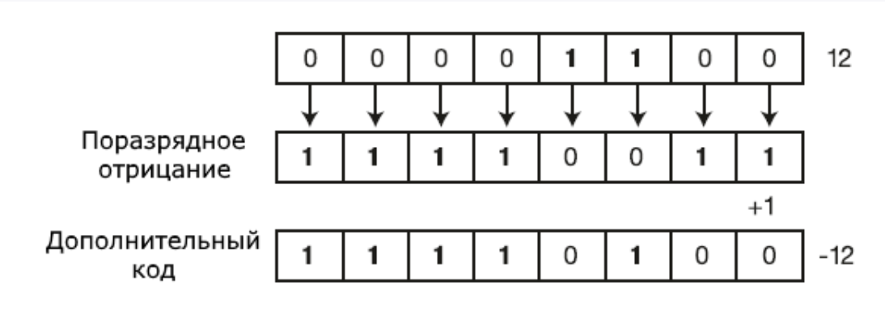

# 2.6. Арифметичні операції мови C#

У C# використовується більшість операцій, які застосовуються і в інших мовах програмування. Операції представляють певні дії над операндами - учасниками операції. Як операнд може виступати змінна або будь-яке значення (наприклад, число). Операції бувають унарними (виконуються над одним операндом), бінарними - над двома операндами та тернарними - виконуються над трьома операндами. Розглянемо всі види операцій.

## Бінарні арифметичні операції

`+` (операція додавання двох чисел):

```csharp
int x = 10;
int z = x + 12; // 22
```

`-` (операція віднімання двох чисел):

```csharp
int x = 10;
int z = x - 6; // 4
```

`*` (операція множення двох чисел):

```csharp
int x = 10;
int z = x * 5; // 50
```

`/` (операція ділення двох чисел):

```csharp
int x = 10;
int z = x / 5; // 2

double a = 10;
double b = 3;
double c = a / b; // 3.33333333
```

При поділі варто враховувати, що якщо обидва операнда представляють цілі числа, то результат буде округлятися до цілого числа:

```csharp
double z = 10 / 4; // Результат дорівнює 2
```

Незважаючи на те, що результат операції в результаті поміщається в змінну типу `double`, яка дозволяє зберегти дробову частину, але в самій операції беруть участь два літерали, які за умовчанням розглядаються як об'єкти `int`, тобто цілі числа, і результат теж буде цілий.

Для виходу з цієї ситуації необхідно визначати літерали або змінні, що беруть участь в операції саме як типи `double` або `float`:

```csharp
double z = 10.0 / 4.0; // Результат дорівнює 2.5
```

`%` (операція отримання залишку від цілісного поділу двох чисел):

```csharp
double x = 10.0;
double z = x % 4.0; // Результат дорівнює 2
```

Також є ряд унарних операцій, у яких бере участь один операнд:

`++` (операція інкременту)

Інкремент буває префіксним: `++x` спочатку значення змінної `x` збільшується на 1, а потім її значення повертається як результат операції.

І також існує постфіксний інкремент: `x++` спочатку значення змінної `x` повертається як результат операції, а потім до нього додається 1.

```csharp
int x1 = 5;
int z1 = ++x1; // z1=6; x1=6
Console.WriteLine($"{x1} - {z1}");

int x2 = 5;
int z2 = x2++; // z2=5; x2=6
Console.WriteLine($"{x2} - {z2}");
```

Операція декременту чи зменшення значення на одиницю. Також існує префіксна форма декременту (`--x`) та постфіксна (`x--`).

```csharp
int x1 = 5;
int z1 = --x1; // z1=4; x1=4
Console.WriteLine($"{x1} - {z1}");

int x2 = 5;
int z2 = x2--; // z2=5; x2=4
Console.WriteLine($"{x2} - {z2}");
```

За виконання відразу кількох арифметичних операцій слід враховувати порядок виконання. Пріоритет операцій від найвищого до нижчого:

- інкремент, декремент
- множення, ділення, отримання залишку
- додавання, віднімання

Для зміни порядку прямування операцій застосовуються дужки.

Розглянемо набір операцій:

```csharp
int a = 3;
int b = 5;
int c = 40;
int d = c-- - b * a; // a=3  b=5  c=39  d=25
Console.WriteLine($"a={a}  b={b}  c={c}  d={d}");
```

Тут ми маємо справу з трьома операціями: декремент, віднімання та множення. Спочатку виконується декремент змінної `c`, потім множення `b * a`, і в кінці віднімання. Тобто фактично набір операцій виглядав так:

```csharp
d = (c--) - (b * a);
```

Але за допомогою дужок ми могли б змінити порядок операцій, наприклад, так:

```csharp
int a = 3;
int b = 5;
int c = 40;
int d = (c - (--b)) * a; // a=3  b=4  c=40  d=108
Console.WriteLine($"a={a}  b={b}  c={c}  d={d}");
```

## Асоціативність операторів

Як вище було зазначено, операції множення та поділу мають один і той же пріоритет, але який тоді результат буде у виразі:

```csharp
int x = 10 / 5 * 2;
```

Чи варто нам трактувати цей вираз як `(10 / 5) * 2` чи як `10 / (5 * 2)`? Адже, залежно від трактування, ми отримаємо різні результати.

Коли операції мають той самий пріоритет, порядок обчислення визначається асоціативністю операторів. Залежно від асоціативності є два типи операторів:

- лівоасоціативні оператори, які виконуються зліва направо
- правоасоціативні оператори, які виконуються праворуч наліво

Усі арифметичні оператори є лівоасоціативними, тобто виконуються зліва направо. Тому вираз `10 / 5 * 2` необхідно трактувати як `(10 / 5) * 2`, тобто результатом буде 4.

# 2.7. Порозрядні операції

Особливий клас операцій представляють порозрядні операції. Вони виконуються над окремими розрядами числа. У цьому плані числа розглядаються у двійковому поданні, наприклад, 2 у двійковому поданні 10 і має два розряди, число 7 - 111 і має три розряди.

## Логічні операції

`&` (логічне множення)

Множення проводиться порозрядно, і якщо в обох операндів значення розрядів дорівнює 1, то операція повертає 1, інакше число повертається 0. Наприклад:

```csharp
int x1 = 2; // 010
int y1 = 5; // 101
Console.WriteLine(x1 & y1); // виведе 0

int x2 = 4; // 100
int y2 = 5; // 101
Console.WriteLine(x2 & y2); // виведе 4
```

У першому випадку ми маємо два числа 2 і 5. 2 у двійковому вигляді представляє число 010, а 5 - 101. Порозрядно помножимо числа (0*1, 1*0, 0*1) й у результаті отримаємо 000.

У другому випадку у нас замість двійки число 4, у якого в першому розряді 1, так само як і у числа 5, тому отримаємо (1*1, 0*0, 0*1) = 100, тобто число 4 в десятковому форматі.

`|` (логічне додавання)

Схоже на логічне множення, операція також здійснюється за двійковими розрядами, але тепер повертається одиниця, якщо хоча б у одного числа в даному розряді є одиниця. Наприклад:

```csharp
int x1 = 2; // 010
int y1 = 5; // 101
Console.WriteLine(x1 | y1); // виведе 7 - 111

int x2 = 4; // 100
int y2 = 5; // 101
Console.WriteLine(x2 | y2); // виведе 5 - 101
```

`^` (логічне виключне АБО)

Також цю операцію називають XOR, нерідко її застосовують для простого шифрування:

```csharp
int x = 45; // Значення, яке треба зашифрувати - в двійковій формі 101101
int key = 102; // Нехай це буде ключ - в двійковій формі 1100110

int encrypt = x ^ key; // Результатом буде число 1001011 або 75
Console.WriteLine($"Зашифроване число: {encrypt}");

int decrypt = encrypt ^ key; // Результатом буде вихідне число 45
Console.WriteLine($"Розшифроване число: {decrypt}");
```

Тут знову ж таки проводяться порозрядні операції. Якщо значення поточного розряду в обох чисел різні, то повертається 1, інакше повертається 0. Таким чином, ми отримуємо з `45 ^ 102` як результат число 75. І щоб розшифрувати число, ми застосовуємо ту ж операцію до результату.

`~` (логічне заперечення чи інверсія)

Ще одна порозрядна операція, яка інвертує всі розряди: якщо значення розряду дорівнює 1, воно стає рівним нулю, і навпаки.

```csharp
int x = 12;             // 00001100
Console.WriteLine(~x);  // 11110011 або -13
```

## Подання негативних чисел

Для запису чисел зі знаком C# застосовується додатковий код (two's complement), у якому старший розряд є знаковим. Якщо його значення дорівнює 0, то число позитивне, та його двійкове уявлення не відрізняється від уявлення беззнакового числа. Наприклад, 0000 0001 у десятковій системі 1.



Якщо старший розряд дорівнює 1, ми маємо справу з негативним числом. Наприклад, 1111 1111 у десятковій системі становить -1. Відповідно, 1111 0011 становить -13.

Щоб отримати з позитивного числа негативне, його потрібно інвертувати та додати одиницю:

```csharp
int x = 12;
int y = ~x;
y += 1;
Console.WriteLine(y); // -12
```

## Операції зсуву

Операції зсуву також виконуються над розрядами чисел. Зсув може відбуватися праворуч і ліворуч.

`x << y` - зсуває число `x` вліво на `y` розрядів. Наприклад, `4 << 1` зсуває число 4 (яке в двійковому поданні 100) на один розряд вліво, тобто в результаті виходить 1000 або число 8 у десятковому поданні.

`x >> y` - зсуває число `x` вправо на `y` розрядів. Наприклад, `16 >> 1` зсуває число 16 (яке в двійковому поданні 10000) на один розряд праворуч, тобто в результаті виходить 1000 або число 8 у десятковому поданні.

Таким чином, якщо вихідне число, яке треба зрушити в ту чи іншу сторону, ділиться на два, то фактично виходить множення чи поділ на два. Тому подібну операцію можна використовувати замість безпосереднього множення чи поділу на два. Наприклад:

```csharp
int a = 16; // в двійковій формі 10000
int b = 2;  // в двійковій формі
int c = a << b; // Зсув числа 10000 вліво на 2 розряди,
                // рівно 1000000 або 64 в десятковій системі

Console.WriteLine($"Результат зсуву вліво: {c}"); // 64

int d = a >> b; // Зсув числа 10000 вправо на 2 розряди,
                // рівно 100 або 4 десятковій системі
Console.WriteLine($"Результат зсуву вправо: {d}"); // 4
```

При цьому числа, які беруть участь в операціях, необов'язково мають бути кратними 2:

```csharp
int a = 22; // в двійковій формі 10110
int b = 2;  // в двійковій формі
int c = a << b; // Зсув числа 10110 вліво на 2 розряди,
                // рівно 1011000 або 88 у десятковій системі

Console.WriteLine($"Результат зсуву вліво: {c}"); // 88

int d = a >> b; // Зсув числа 10110 вправо на 2 розряди,
                // рівно 101 або 5 у десятковій системі
Console.WriteLine($"Результат зсуву вправо: {d}"); // 5
```

# 2.8. Операції присвоєння

Операції присвоєння встановлюють значення. В операціях присвоєння беруть участь два операнди, причому лівий операнд може представляти тільки модифікований іменований вираз, наприклад, змінну.

Як і в багатьох інших мовах програмування, у C# є базова операція присвоєння `=`, яка надає значення правого операнда лівому операнду:

```csharp
int number = 23;
```

Тут змінній `number` присвоюється число 23. Змінна `number` представляє лівий операнд, якому присвоюється значення правого операнда, тобто 23.

Також можна виконувати множинне присвоєння відразу кількох змінних одночасно:

```csharp
int a, b, c;
a = b = c = 34;
```

Варто зазначити, що операції присвоєння мають низький пріоритет. І спочатку обчислюватиметься значення правого операнда і потім буде присвоєння цього значення лівому операнду. Наприклад:

```csharp
int a, b, c;
a = b = c = 34 * 2 / 4; // 17
```

Спочатку обчислюватиметься вираз `34 * 2 / 4`, потім отримане значення буде присвоєно змінним.

Крім базової операції присвоєння C# є ще ряд операцій:

- `+=`: присвоєння після додавання. Надає лівому операнду суму лівого та правого операндів: вираз `A += B` рівнозначний виразу `A = A + B`
- `-=`: присвоєння після віднімання. Надає лівому операнду різницю лівого і правого операнда: `A -= B` еквівалентно `A = A - B`
- `*=`: присвоєння після множення. Надає лівому операнду добуток лівого та правого операндів: `A *= B` еквівалентно `A = A * B`
- `/=`: присвоєння після ділення. Надає лівому операнду частку лівого та правого операндів: `A /= B` еквівалентно `A = A / B`
- `%=`: присвоєння після ділення по модулю. Надає лівому операнду залишок від цілого ділення лівого операнда на правий: `A %= B` еквівалентно `A = A % B`
- `&=`: присвоєння після порозрядної кон'юнкції. Надає лівому операнду результат порозрядної кон'юнкції його бітового уявлення з бітовим уявленням правого операнда: `A &= B` еквівалентно `A = A & B`
- `|=`: присвоєння після порозрядної диз'юнкції. Надає лівому операнду результат порозрядної диз'юнкції його бітового уявлення з бітовим уявленням правого операнда: `A |= B` еквівалентно `A = A | B`
- `^=`: присвоєння після операції, що виключає АБО. Надає лівому операнду результат операції виключного АБО його бітового уявлення з бітовим поданням правого операнда: `A ^= B` еквівалентно `A = A ^ B`
- `<<=`: присвоєння після зсуву розрядів вліво. Надає лівому операнду результат зсуву його бітового подання вліво на певну кількість розрядів, що дорівнює значенню правого операнда: `A <<= B` еквівалентно `A = A << B`
- `>>=`: присвоєння після зсуву розрядів праворуч. Надає лівому операнду результат зсуву його бітового подання вправо на певну кількість розрядів, що дорівнює значенню правого операнда: `A >>= B` еквівалентно `A = A >> B`

Застосування операцій присвоєння:

```csharp
int a = 10;
a += 10;  // 20
a -= 4;   // 16
a *= 2;   // 32
a /= 8;   // 4
a <<= 4;  // 64
a >>= 2;  // 16
```

Операції присвоєння є правоасоціативними, тобто виконуються праворуч наліво. Наприклад:

```csharp
int a = 8;
int b = 6;
int c = a += b -= 5; // 9
```

В даному випадку виконання виразу йтиме таким чином:

1. `b -= 5` (`6 - 5 = 1`)
2. `a += (b -= 5)` (`8 + 1 = 9`)
3. `c = (a += (b -= 5))` (`c = 9`)
