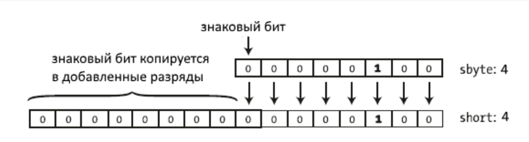
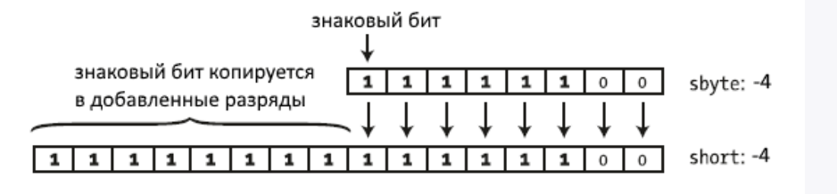
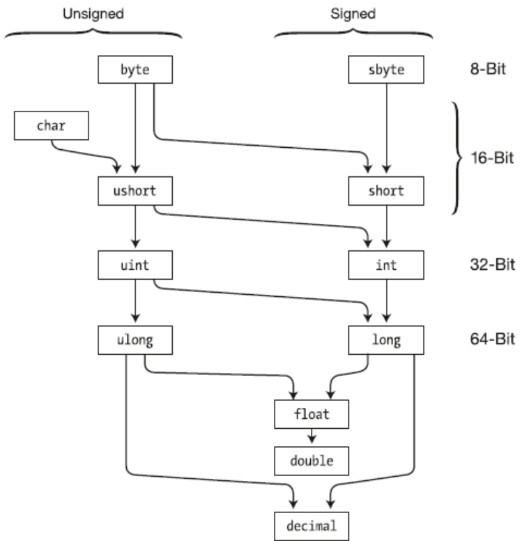

# 2.9. Перетворення базових типів даних

При розгляді типів даних вказувалося, які значення може мати той чи інший тип і скільки байт пам'яті може займати. У минулій темі було розглянуто арифметичні операції. Тепер застосуємо операцію додавання до даних різних типів:

```csharp
byte a = 4;
int b = a + 70;
```

Результатом операції цілком справедливо є число 74, як і очікується.

Але тепер спробуємо застосувати додавання до двох об'єктів типу `byte`:

```csharp
byte a = 4;
byte b = a + 70; // помилка
```

Тут змінився тільки тип змінної, яка отримує результат додавання - з `int` на `byte`. Проте при спробі скомпілювати програму ми отримаємо помилку на етапі компіляції. І якщо ми працюємо в Visual Studio, середовище підкреслить другий рядок червоною хвилястою лінією, вказуючи, що в ній є помилка.

Під час операцій ми повинні враховувати діапазон значень, які може зберігати той чи інший тип. Але в даному випадку число 74, яке ми очікуємо отримати, цілком укладається в діапазон значень типу `byte`, проте ми отримуємо помилку.

Справа в тому, що операція додавання (та й віднімання) повертає значення типу `int`, якщо в операції беруть участь цілі численні типи даних з розрядністю менше або дорівнює `int` (тобто типи `byte`, `short`, `int`). Тому результатом операції `a + 70` буде об'єкт, який має довжину в пам'яті 4 байти. Потім цей об'єкт ми намагаємось присвоїти змінній `b`, яка має тип `byte` і в пам'яті займає 1 байт.

І щоб вийти із цієї ситуації, необхідно застосувати операцію перетворення типів. Операція перетворення типів передбачає вказівку у дужках того типу, до якого треба перетворити значення:

```text
(Тип даних_в_який_треба_перетворити)значення для перетворення;
```

Так, змінимо попередній приклад, застосувавши операцію перетворення типів:

```csharp
byte a = 4;
byte b = (byte)(a + 70);
```

## Звужувальні і розширювальні перетворення

Перетворення можуть бути звужувальні (narrowing) та розширюючі (widening). Перетворення, що розширюють, розширюють розмір об'єкта в пам'яті. Наприклад:

```csharp
byte a = 4;   // 00000100
ushort b = a; // 0000000000000100
```

У разі змінній типу `ushort` присвоюється значення типу `byte`. Тип `byte` займає 1 байт (8 біт), і значення змінної `a` у двійковому вигляді можна уявити як:

```text
00000100
```

Значення типу `ushort` займає 2 байти (16 біт). І за присвоєння змінній `b` значення змінної `a` розширюється до 2 байт:

```text
0000000000000100
```

Тобто значення, що займає 8 біт, розширюється до 16 біт.

Звужуючі перетворення, навпаки, звужують значення до типу меншої розрядності. У другому лістингу статті ми мали справу зі звужуючими перетвореннями:

```csharp
ushort a = 4;
byte b = (byte)a;
```

Тут змінній `b`, яка займає 8 біт, присвоюється значення `ushort`, яке займає 16 біт. Тобто з `0000000000000100` отримуємо `00000100`. Таким чином значення звужується з 16 біт (2 байт) до 8 біт (1 байт).

# 2.10. Явні та неявні перетворення

## Неявні перетворення

У випадку з розширювальними перетвореннями компілятор за нас виконував усі перетворення даних, тобто перетворення були неявними (implicit conversion). Такі перетворення не викликають якихось труднощів. Проте варто сказати кілька слів про загальну механіку подібних перетворень.

Якщо відбувається перетворення від беззнакового типу меншої розрядності до беззнакового типу великої розрядності, то додаються додаткові біти, які мають значення 0. Це називається доповнення нулями або zero extension.

```csharp
byte a = 4;   // 00000100
ushort b = a; // 0000000000000100
```

Якщо виробляється перетворення до знакового типу, то бітове уявлення доповнюється нулями, якщо число позитивне, і одиницями, якщо число негативне. Останній розряд числа містить знаковий біт - 0 для позитивних та 1 для негативних чисел. При розширенні додані розряди копіюють знаковий біт.

Розглянемо перетворення позитивного числа:

```csharp
sbyte a = 4; // 00000100
short b = a; // 0000000000000100
```



Перетворення від'ємного числа:

```csharp
sbyte a = -4; // 11111100
short b = a;  // 1111111111111100
```



## Явні перетворення

При явних перетвореннях (explicit conversion) ми маємо застосувати операцію перетворення (операція `()`). Суть операції перетворення типів у тому, що перед значенням вказується в дужках тип, до якого треба привести дане значення:

```csharp
int a = 4;
int b = 6;
byte c = (byte)(a + b);
```

Перетворення, що розширюють, від типу з меншою розрядністю до типу з більшою розрядністю компілятор проводить неявно. Це можуть бути такі ланцюжки перетворень:

```text
byte -> short -> int -> long -> decimal
int -> double
short -> float -> double
char -> int
```

Усі безпечні автоматичні перетворення можна описати такою таблицею:



За інших випадках слід використовувати явні перетворення типів.

Також слід зазначити, що незважаючи на те, що і `double`, і `decimal` можуть зберігати дробові дані, а `decimal` має більшу розрядність, ніж `double`, але все одно значення `double` потрібно явно наводити до типу `decimal`:

```csharp
double a = 4.0;
decimal b = (decimal)a;
```

## Втрата даних та ключове слово checked

Розглянемо іншу ситуацію, що буде, наприклад, у такому разі:

```csharp
int a = 33;
int b = 600;
byte c = (byte)(a + b);
Console.WriteLine(c); // 121
```

Результатом буде число 121, так число 633 не потрапляє в допустимий діапазон типу `byte`, і старші біти будуть усікатися. Через це вийде число 121. Тому при перетвореннях треба враховувати. І ми в даному випадку можемо взяти такі числа `a` і `b`, які в сумі дадуть число не більше 255, або ми можемо вибрати замість `byte` інший тип даних, наприклад, `int`.

Однак, ситуації різні можуть бути. Ми можемо точно не знати, які значення матимуть числа `a` та `b`. І щоб уникнути подібних ситуацій, у C# є ключове слово `checked`:

```csharp
try
{
    int a = 33;
    int b = 600;
    byte c = checked((byte)(a + b));
    Console.WriteLine(c);
}
catch (OverflowException ex)
{
    Console.WriteLine(ex.Message);
}
```

У разі використання ключового слова `checked` програма викидає виняток про переповнення. Тому для його обробки у разі використовується конструкція `try...catch`. Докладніше цю конструкцію та обробку винятків ми розглянемо пізніше, а поки що треба знати, що в блок `try` ми включаємо дії, в яких може потенційно виникнути помилка, а в блоці `catch` обробляємо помилку.
