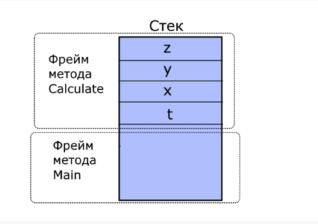
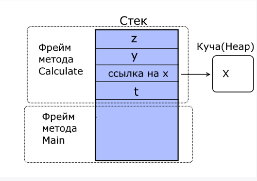
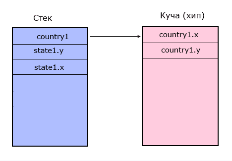
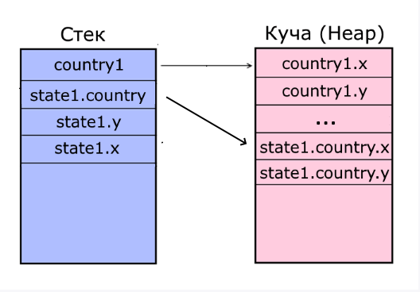
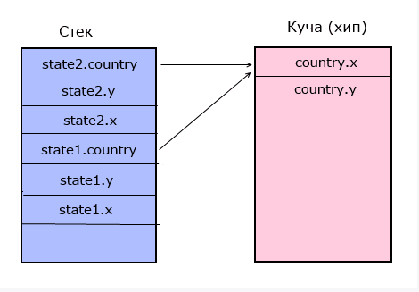

# Типи значень та типи посилань

Раніше ми розглядали такі елементарні типи даних: `int`, `byte`, `double`, `string`, `object` та ін. Також складні типи: структури, перерахування, класи. Всі ці типи даних можна розділити на типи значень, які називаються значущими типами (value types), і типи посилань (reference types). Важливо розуміти відмінності між ними.

Типи значень:

- Цілочисленні типи (`byte`, `sbyte`, `short`, `ushort`, `int`, `uint`, `long`, `ulong`)
- Типи з плаваючою комою (`float`, `double`)
- Тип `decimal`
- Тип `bool`
- Тип `char`
- Перерахування `enum`
- Структури (`struct`)

Посилальні типи:

- Тип `object`
- Тип `string`
- Класи (`class`)
- Інтерфейси (`interface`)
- Делегати (`delegate`)

У чому між ними відмінності? Для цього треба зрозуміти організацію пам'яті у .NET. Тут пам'ять ділиться на два типи: стек та купа (heap). Параметри та змінні методів, які представляють типи значень, розміщують своє значення у стеку. Стек являє собою структуру даних, яка росте знизу вгору: кожен новий елемент, що додається, поміщається поверх попереднього. Час життя таких змінних обмежений їх контекстом. Фізично стек - це деяка область пам'яті в адресному просторі.

Коли програма тільки запускається на виконання, в кінці блоку пам'яті, зарезервованого для стека, встановлюється покажчик стека. При розміщенні даних у стек покажчик встановлюється таким чином, що знову вказує на нове вільне місце. При виклику кожного окремого методу в стеку виділятиметься область пам'яті або кадр стека, де зберігатимуться значення його параметрів та змінних.

Наприклад:

```csharp
class Program
{
    static void Main(string[] args)
    {
        Calculate(5);
    }

    static void Calculate(int t)
    {
        int x = 6;
        int y = 7;
        int z = y + t;
    }
}
```

При запуску такої програми в стеку будуть визначатися два кадри - для методу `Main` (оскільки він викликається при запуску програми) і для методу `Calculate`:



При виклику цього методу `Calculate` у його кадр у стеку будуть розміщуватися значення `t`, `x`, `y` та `z`. Вони визначаються у тілі даного методу. Коли метод відпрацює, область пам'яті, яка виділялася під стек, згодом може бути використана іншими методами.

Причому якщо параметр або змінна методу є типом значень, то в стеку буде зберігатися безпосереднє значення цього параметра або змінної. Наприклад, у разі змінні і параметр методу `Calculate` представляють значущий тип - тип `int`, у стеку зберігатимуться їх числові значення.

Типи посилань зберігаються в купі або хіпі, яку можна представити як невпорядкований набір різнорідних об'єктів. Фізично це решта пам'яті, яка доступна процесу.

При створенні об'єкта посилального типу в стеку міститься посилання на адресу в купі (хіпі). Коли об'єкт посилального типу перестає використовуватися, у справу вступає автоматичний збирач сміття: він бачить, що на об'єкт у хіпі немає більше посилань, умовно видаляє цей об'єкт і очищає пам'ять - фактично позначає, що даний сегмент пам'яті може бути використаний для зберігання інших даних.

Так, зокрема, якщо змінимо метод `Calculate` так:

```csharp
static void Calculate(int t)
{
    object x = 6;
    int y = 7;
    int z = y + t;
}
```

Тепер значення змінної `x` зберігатиметься у купі, оскільки вона представляє тип `object`, а в стеку буде зберігатися посилання на об'єкт у купі.



## Складові типи

Тепер розглянемо ситуацію, коли тип значень і тип посилань представляють складові типи - структуру і клас:

```csharp
State state1 = new State(); // State - структура, її дані розміщені у стеку
Country country1 = new Country(); // Country - клас, у стек міститься посилання на адресу в хіпі
// а в хіпі розташовуються всі дані об'єкта country1

struct State
{
    public int x;
    public int y;
}

class Country
{
    public int x;
    public int y;
}
```

Тут у методі `Main` у стеку виділяється пам'ять для об'єкта `state1`. Далі в стеку створюється посилання об'єкта `country1` (`Country country1`), а за допомогою виклику конструктора з ключовим словом `new` виділяється місце у хіпі (`new Country()`). Посилання в стеку для об'єкта `country1` буде представляти адресу на місце в хіпі, за яким розміщений даний об'єкт.



Таким чином, у стеку будуть всі поля структури `state1` і посилання на об'єкт `country1` в хіпі.

Але, припустимо, у структурі `State` також визначено змінну посилального типу `Country`. Де вона зберігатиме своє значення, якщо вона визначена у типі значень?

```csharp
State state1 = new State();
Country country1 = new Country();

struct State
{
    public int x;
    public int y;
    public Country country;

    public State()
    {
        x = 0;
        y = 0;
        country = new Country();
    }
}

class Country
{
    public int x;
    public int y;
}
```

Значення змінної `state1.country` також буде зберігатися в купі, так як ця змінна представляє тип посилання:



## Копіювання значень

Тип даних треба враховувати під час копіювання значень. При наданні даних об'єкту значущого типу він отримує копію даних. При присвоєнні даних об'єкту типу посилання він отримує не копію об'єкта, а посилання на цей об'єкт у хіпі. Наприклад:

```csharp
State state1 = new State(); // Структура State
State state2 = new State();
state2.x = 1;
state2.y = 2;
state1 = state2;
state2.x = 5; // state1.x = 1, як і раніше
Console.WriteLine(state1.x); // 1
Console.WriteLine(state2.x); // 5

Country country1 = new Country(); // Клас Country
Country country2 = new Country();
country2.x = 1;
country2.y = 4;
country1 = country2;
country2.x = 7; // тепер і country1.x = 7, тому що обидва посилання, і country1, і country2,
// вказують на один об'єкт у хіпі
Console.WriteLine(country1.x); // 7
Console.WriteLine(country2.x); // 7
```

Так як `state1` - структура, то при присвоєнні `state1 = state2` вона отримує копію структури `state2`. А об'єкт класу `country1` при присвоєнні `country1 = country2` отримує посилання на той самий об'єкт, на який вказує `country2`. Тому зі зміною `country2` так само змінюватиметься і `country1`.

## Посилальні типи всередині типів значень

Тепер розглянемо більш витончений приклад, коли всередині структури у нас може бути змінна типу посилання, наприклад, якогось класу:

```csharp
State state1 = new State();
State state2 = new State();

state2.country = new Country();
state2.country.x = 5;
state1 = state2;
state2.country.x = 8; // тепер і state1.country.x = 8, оскільки state1.country та state2.country
// вказують на один об'єкт у хіпі
Console.WriteLine(state1.country.x); // 8
Console.WriteLine(state2.country.x); // 8

struct State
{
    public int x;
    public int y;
    public Country country;

    public State()
    {
        x = 0;
        y = 0;
        country = new Country(); // Виділення пам'яті для об'єкта Country
    }
}

class Country
{
    public int x;
    public int y;
}
```

Змінні типів посилань у структурах також зберігають у стеку посилання на об'єкт у хіпі. І при присвоєнні двох структур `state1 = state2` структура `state1` також отримає посилання на об'єкт `country` у хіпі. Тому зміна `state2.country` спричинить також зміну `state1.country`.


