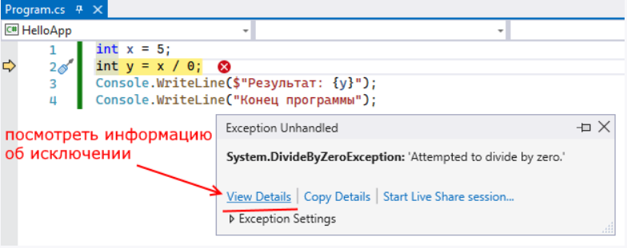


## 5.1. Конструкція try..catch..finally

Іноді під час виконання програми виникають помилки, які важко передбачити чи передбачати, інколи ж зовсім неможливо. Наприклад, при передачі файлу через мережу може несподівано обірватися мережне підключення. Такі ситуації називаються винятками. Мова C# надає розробникам можливості обробки таких ситуацій. Для цього в C# призначена конструкція try...catch...finally.

```csharp
try
{

}
catch
{

}
finally
{

}
```

При використанні блоку try...catch..finally спочатку виконуються всі інструкції у блоці try. Якщо в цьому блоці не виникло винятків, то після виконання починає виконуватися блок finally. І потім конструкція try..catch..finally завершує свою роботу.

Якщо ж у блоці try раптом з'являється виняток, то нормальний порядок виконання зупиняється, і середовище CLR починає шукати блок catch, який може обробити цей виняток. Якщо потрібний блок catch знайдений, він виконується, і після його завершення виконується блок finally.

Якщо потрібний блок catch не знайдено, при виникненні винятку програма аварійно завершує своє виконання.

Розглянемо наступний приклад:

```csharp
int x = 5;
int y = x / 0;
Console.WriteLine($"Результат: {y}");
Console.WriteLine("Кінець програми");
```

У разі відбувається ділення числа на 0, що призведе до генерації винятку. І при запуску програми в режимі налагодження ми побачимо у Visual Studio віконце, яке повідомляє про виняток:



У цьому віконці бачимо, що виник виняток, який представляє тип `System.DivideByZeroException`, тобто спроба поділу на нуль. За допомогою пункту View Details можна переглянути детальнішу інформацію про виняток.

І в цьому випадку єдине, що нам залишається, це завершити виконання програми.

Щоб уникнути такого аварійного завершення програми, слід використовувати для обробки винятків конструкцію try...catch...finally. Так, перепишемо приклад так:

```csharp
try
{
    int x = 5;
    int y = x / 0;
    Console.WriteLine($"Результат: {y}");
}
catch
{
    Console.WriteLine("Виник виняток!");
}
finally
{
    Console.WriteLine("Блок finally");
}
Console.WriteLine("Кінець програми");
```

В даному випадку у нас знову ж таки виникне виняток у блоці try, тому що ми намагаємося розділити на нуль. І дійшовши до рядка

```csharp
int y = x / 0;
```

виконання програми зупиниться. CLR знайде блок catch і передасть керування блоку.

Після блоку catch буде виконуватись блок finally.


Таким чином, програма, як і раніше, не виконуватиме поділ на нуль і відповідно не виводитиме результат цього поділу, але тепер вона не буде аварійно завершуватися, а виняток буде оброблятися в блоці catch.

Слід зазначити, що у цій конструкції обов'язковий блок try. За наявності блоку catch ми можемо опустити блок finally.

```csharp
try
{
    int x = 5;
    int y = x / 0;
    Console.WriteLine($"Результат: {y}");
}
catch
{
    Console.WriteLine("Виник виняток!");
}
```

І, навпаки, за наявності блоку finally ми можемо опустити блок catch і не обробляти виняток:

```csharp
try
{
    int x = 5;
    int y = x / 0;
    Console.WriteLine($"Результат: {y}");
}
finally
{
    Console.WriteLine("Блок finally");
}
```

Однак, хоча з погляду синтаксису C# така конструкція цілком коректна, проте, оскільки CLR не зможе знайти потрібний блок catch, виняток не буде оброблено, і програма аварійно завершиться.

### Обробка винятків та умовні конструкції

Ряд виняткових ситуацій може бути передбачений розробником. Наприклад, нехай у програмі є метод, який приймає рядок, конвертує його в число та обчислює квадрат цього числа:

```csharp
Square("12"); // Квадрат числа 12: 144
Square("ab"); // ! Виняток

void Square(string data)
{
    int x = int.Parse(data);
    Console.WriteLine($"Квадрат числа {x}: {x * x}");
}
```

Якщо користувач передасть у метод не число, а рядок, який містить нецифрові символи, то програма випаде в помилку. З одного боку, тут якраз та ситуація, коли можна застосувати блок try..catch, щоб обробити можливу помилку. Однак набагато оптимальніше було б перевірити допустимість перетворення:

```csharp
Square("12"); // Квадрат числа 12: 144
Square("ab"); // Некоректне введення

void Square(string data)
{
    if (int.TryParse(data, out var x))
    {
        Console.WriteLine($"Квадрат числа {x}: {x * x}");
    }
    else
    {
        Console.WriteLine("Некоректне введення");
    }
}
```

Метод `int.TryParse()` повертає `true`, якщо перетворення можна здійснити, і `false`, якщо не можна. При допустимості перетворення змінна `x` міститиме введене число. Так, не використовуючи try...catch, можна обробити можливу виняткову ситуацію.

З погляду продуктивності використання блоків try..catch більш накладно, ніж застосування умовних конструкцій. Тому, по можливості, замість try..catch краще використовувати умовні конструкції на перевірку виняткових ситуацій.
