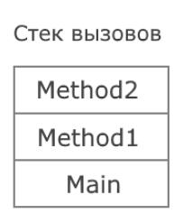


## 5.6. Пошук блоку catch при обробці винятків

Якщо код, який викликає виняток, не розміщений в блоці try або поміщений в конструкцію try..catch, яка не містить відповідного блоку catch для обробки винятку, що виник, то система здійснює пошук відповідного обробника винятку в стеку викликів.

Наприклад, розглянемо таку програму:

```csharp
try
{
    TestClass.Method1();
}
catch (DivideByZeroException ex)
{
    Console.WriteLine($"Catch в Main : {ex.Message}");
}
finally
{
    Console.WriteLine("Блок finally в Main");
}
Console.WriteLine("Кінець методу Main");

class TestClass
{
    public static void Method1()
    {
        try
        {
            Method2();
        }
        catch (IndexOutOfRangeException ex)
        {
            Console.WriteLine($"Catch в Method1 : {ex.Message}");
        }
        finally
        {
            Console.WriteLine("Блок finally в Method1");
        }
        Console.WriteLine("Кінець методу Method1");
    }

    static void Method2()
    {
        try
        {
            int x = 8;
            int y = x / 0;
        }
        finally
        {
            Console.WriteLine("Блок finally в Method2");
        }
        Console.WriteLine("Кінець методу Method2");
    }
}
```

У цьому випадку стек викликів виглядає так: метод Main викликає метод Method1, який, своєю чергою, викликає метод Method2. І в методі Method2 генерується виняток DivideByZeroException. Візуально стек викликів можна представити так:



Внизу стека метод Main, з якого почалося виконання, і на вершині метод Method2.

Що відбуватиметься у разі при генерації винятку?

Метод Main викликає метод Method1, а той викликає метод Method2, у якому генерується виняток DivideByZeroException.

Система бачить, що код, який викликав виняток, поміщений у конструкцію try.

```csharp
try
{
    int x = 8;
    int y = x / 0;
}
finally
{
    Console.WriteLine("Блок finally в Method2");
}
```

Система шукає в цій конструкції блок catch, який обробляє виняток DivideByZeroException. Однак такого блоку catch немає.

Система опускається в стеку викликів у метод Method1, який викликав Method2. Тут виклик Method2 поміщений у конструкцію try.

```csharp
try
{
    Method2();
}
catch (IndexOutOfRangeException ex)
{
    Console.WriteLine($"Catch в Method1 : {ex.Message}");
}
finally
{
    Console.WriteLine("Блок finally в Method1");
}
```

Система також шукає в цій конструкції блок catch, який обробляє виняток DivideByZeroException. Однак тут також такий блок catch відсутній.

Система далі опускається в стеку викликів у метод Main, який викликав Method1. Тут виклик Method1 поміщений у конструкцію try.

```csharp
try
{
    TestClass.Method1();
}
catch (DivideByZeroException ex)
{
    Console.WriteLine($"Catch в Main : {ex.Message}");
}
finally
{
    Console.WriteLine("Блок finally в Main");
}
```

Система знову шукає у цій конструкції блок catch, який обробляє виняток DivideByZeroException. І в цьому випадку такий блок знайдено.

Система нарешті знайшла потрібний блок catch у методі Main, для обробки винятку, який виник у методі Method2 - тобто до початкового методу, де безпосередньо виник виняток. Але поки що цей блок catch НЕ виконується. Система піднімається назад по стеку викликів у самий верх метод Method2 і виконує в ньому блок finally:

```csharp
finally
{
    Console.WriteLine("Блок finally в Method2");
}
```

Далі система повертається по стеку викликів вниз метод Method1 і виконує в ньому блок finally:

```csharp
finally
{
    Console.WriteLine("Блок finally в Method1");
}
```

Потім система переходить по стеку викликів вниз метод Main і виконує в ньому знайдений блок catch і наступний блок finally:

```csharp
catch (DivideByZeroException ex)
{
    Console.WriteLine($"Catch в Main : {ex.Message}");
}
finally
{
    Console.WriteLine("Блок finally в Main");
}
```

Далі виконується код, який йде в методі Main після конструкції try.

```csharp
Console.WriteLine("Кінець методу Main");
```

Варто зазначити, що код, який іде після конструкції try...catch у методах Method1 та Method2, не виконується, тому що обробник винятку знайдено саме у методі Main.

Консольний вивід програми:


